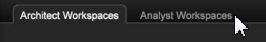

# 속성 프로필{#attribution-profile}

{{eol}}

Data Workbench에서 새 규칙 기반 속성 프로필을 사용하면 속성 이벤트를 신속하게 분석하고 사용자가 정의한 성공적인 전환을 위한 권한을 지정할 수 있습니다. 속성 프로필은 Data Architect에서 해당 기능을 설정하고 확장하는 데 필요한 정보를 제공합니다. 여기에는 분석가가 바로 로그인하고 분석을 시작할 수 있도록 미리 빌드된 작업 공간이 포함되어 있습니다.

기여도 분석 프로필을 사용하면 마케팅 활동과 성공적인 고객 리드 생성 또는 판매 전환 간의 관계를 새로운 관점에서 파악할 수 있습니다. 속성 프로필은 고객 여정에서 구현된 매출 또는 기여도 다운스트림에 대해 크레딧을 받아야 하는 상호 작용을 평가하는 데 도움이 됩니다. Adobe Campaign을 사용하면 속성 이벤트를 신속하게 분석한 다음 첫 번째 또는 마지막 터치 또는 성공적인 판매로 이어지는 기타 이벤트에 대한 책임을 할당하여 마케팅 노력과 비용의 영향을 식별하는 데 도움이 됩니다.

<!--  -->

>[!IMPORTANT]
>
>속성 프로필은 Analytics(SC/Insight) 데이터 피드를 사용하는 Adobe SC 프로필을 구현한 사용자가 즉시 사용하도록 구성됩니다. 기본적으로 마케팅 및 전환 이벤트는 제공된 규칙 기반 모델에서 평가된 기본 상호 작용 유형으로 사용됩니다.

자세한 내용은 [속성 프로필 배포](../../../../home/c-get-started/c-attribution-profiles/c-rules-attrib/c-attrib-profile-deploy.md#concept-fbcb5800cd6a40cc901e61f3882988c0) 및 [속성 모델](../../../../home/c-get-started/c-attribution-profiles/c-rules-attrib/c-attrib-models.md#concept-e209c7e86a5c4008ad6d78fdf4ea032d) 추가 정보.

## 아키텍처 및 분석가 작업 공간 {#section-27c6aff70ba147cca6e11451e127afb4}

기여도 분석 프로필 내에 Workbench의 개별 탭에 Architect 및 Analyst 작업 공간이 정의되어 있습니다.

**아키텍처 작업 공간**

내 **속성** 탭에서 **[!UICONTROL Architect Workspace]** 탭하여 기본 속성 모델링을 위한 구성 파일을 설정하도록 특별히 설계된 작업 공간을 열 수 있습니다.

아키텍처 탭에는 프로필 데이터 세트 폴더에 있는 각 구성 파일을 단계별로 안내하는 작업 공간이 포함되어 있습니다. 예, **[!UICONTROL Attribution Configuration - Step 1]** 에서는 [!DNL profile.cfg] 파일.

**분석가 작업 공간** 을(를) 클릭합니다. **[!UICONTROL Analyst]** **[!UICONTROL Workspaces]** 탭하여 속성 프로필과 함께 제공된 차원 및 지표를 활용하여 사전 빌드된 분석을 열 수 있습니다.

이러한 작업 공간은 다음 네 가지 범주로 구성됩니다.

1. **기본 보고서** 작업 공간에 단일 모델을 노출합니다.
1. **비교 보고서** 단일 보기 내에 여러 모델을 표시하여 분석을 확장했습니다.
1. **조사 보고서** 보고 템플릿을 확장하여 속성 모델을 다른 형식으로 표시합니다. 또한 이 섹션에서는 위치 기반 가중치를 소개하고 노출합니다.
1. **경로 지정 보고서** 다양한 경로 지정 시각화를 통해 고객의 마케팅 여정을 시각화하여 프로세스 흐름과 상호 작용 경로를 완전히 탐색하고 표현할 수 있습니다

분석가 탭에는 보고서가 미리 구성된 작업 공간이 있습니다. 예, **[!UICONTROL First Attribution]** 을(를) 통해 **[!UICONTROL Campaign]** 표 **[!UICONTROL Revenue]** 속성 기반 **[!UICONTROL Time]**.

