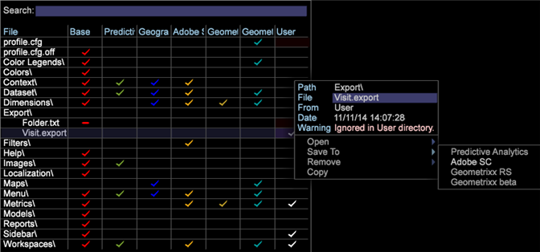

# 사용자 지정 헤더로 세그먼트 내보내기{#segment-export-with-custom-headers}

세그먼트 내보내기 파일에 대한 사용자 정의 열 내보내기 헤더를 만들어 내보낸 세그먼트에 대해 쉽게 이해할 수 있는 설명을 추가합니다. 이 내보내기 기능을 사용하면 TSV 및 CSV 파일로 출력할 수도 있습니다.

헤더나 CSV 및 TSV 포맷으로 내보낼 수 있는 기능을 포함하여 세그먼트 내보내기에 새로운 기능이 추가되었습니다.

내보내기 파일에 대한 열 머리글을 만들 수 있습니다.

## 새 세그먼트 내보내기 만들기 {#section-cffff55855f8467ea468b71393ab7676}

1. 작업 영역을 열고 마우스 오른쪽 단추를 **[!UICONTROL Tools]** > **[!UICONTROL Detail Table]**&#x200B;클릭합니다.

1. 마우스 오른쪽 단추를 클릭하고 **[!UICONTROL Add Level > Extended]** > 항목 선택을 선택합니다.
1. 제목을 마우스 오른쪽 단추로 클릭하고 **[!UICONTROL Add Attribute.]** 메뉴에서 차원 선택을 선택합니다.

1. 제목을 마우스 오른쪽 단추로 클릭하고 **[!UICONTROL Add Metric.]** 메뉴에서 지표 선택을 선택합니다.

1. 제목을 마우스 오른쪽 단추로 클릭하고 **[!UICONTROL New Segment Export]**&#x200B;선택합니다.

   

   **[!UICONTROL New Segment Export with Header]** 열 이름을 지표의 이름으로 자동으로 채웁니다. **[!UICONTROL New Segment Export]** 사용자 지정 이름을 설정해야 합니다. 

   >[!NOTE]
   >
   >열 이름 필드를 비워 둘 수 없거나 머리글이 없습니다.

1. 세그먼트를 마우스 오른쪽 단추로 클릭하고 이름을 지정한 다음 을 클릭합니다 **[!UICONTROL Save Export File]**.

   내보내기 창이 열립니다.

1. 내보내기 이름을 마우스 오른쪽 단추로 클릭하고 다른 이름으로 **[!UICONTROL 저장을 클릭합니다<export filename>]**를 참조하십시오.

   

1. 마우스 오른쪽 단추를 클릭하여 [!DNL Admin] > [!DNL Profile Manager] > [!DNL Expand Export]을 클릭합니다. 방금 만든 내보내기 파일을 찾아 기존 프로파일에 저장합니다.

   

