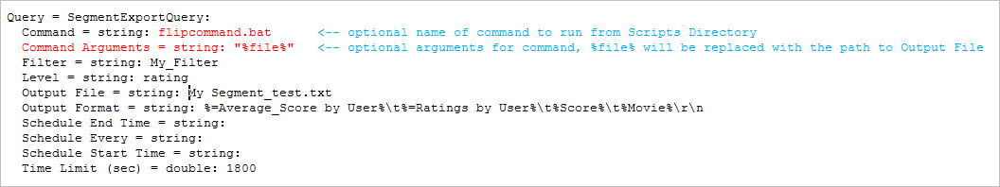
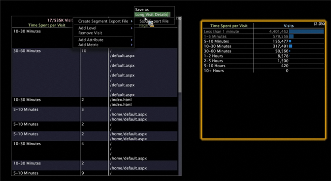

# 세그먼트 내보내기{#segment-export}

Data Workbench 클라이언트의 세부 사항 테이블 시각화에서 세그먼트 내보내기 정의를 쉽게 만들 수 있습니다.

또한 외부 프로세스를 사용하여 결합해야 하는 각 DPU의 부분 결과를 생성하는 대신 [!DNL Segment Exports]은(는) 자동으로 결과를 단일 서버에 결합합니다. 세그먼트 내보내기 파일을 만들어 [!DNL Profile Manager]에 저장하고 선택한 서버에 출력 파일을 업로드할 수 있습니다.

**세그먼트 내보내기 서버를 구성하려면**

[!DNL Segment Export] 기능은 각 DPU에서 작성된 별도의 출력 파일이 아닌 세그먼트 내보내기 서버에 단일 출력 파일을 만듭니다. 세그먼트 내보내기 서버는 일반적으로 FSU에서 실행되도록 구성됩니다.

[!DNL Profile Manager]의 Dataset\ 디렉토리에서 Workstation의 [!DNL Segment Export.cfg]을 열고 서버의 주소를 지정합니다. (주소는 IP 또는 정규화된 도메인 이름일 수 있습니다.):


세그먼트 내보내기 결과를 받는 Data Workbench 서버의 IP입니다. 일회성 설정입니다. [!DNL Segment Export.cfg] 이 없으면 내보내기가 실행되지 않습니다.

**내보내기 디렉토리를 구성하려면**

보안을 위해 세그먼트 내보내기 후에 실행되는 실행 파일 또는 배치 파일은 세그먼트 내보내기 서버의 구성 가능한 Scripts\ 디렉토리에 있어야 합니다.

[!DNL .part] 및 최종 출력은 구성 가능한 내보내기 디렉토리에 있어야 합니다. 실행할 명령이 명령 및 명령 인수에 있습니다. 명령 인수에 있는 %file%의 인스턴스는 출력 파일의 경로로 대체됩니다.

>[!NOTE]
>
>Data Workbench 5.4를 새로 만들면 \Exports 폴더가 자동으로 생성됩니다. 버전 5.4 이전에 설정된 이전 내보내기 디렉토리에는 각 세그먼트 내보내기에 대한 파일 이름 앞에 내보내기\ 접두사가 있어야 합니다. 이제 이 접두사를 추가할 수 없습니다.

1. [!DNL Segment Exports]에 대한 대상 서버의 [!DNL Communications.cfg]에서 SegmentExportServer를 서버 목록에 추가합니다. (빨간색으로 표시된 예)

   

   내보내기 디렉토리:[!DNL .part] 및 출력 파일을 넣을 위치를 지정합니다. 공유 디렉토리일 수 있습니다.

   스크립트 디렉토리:모든 실행 파일 또는 배치 파일을 실행할 디렉토리를 지정합니다.

1. [!DNL Access Control.cfg]같은 서버에서 URI /SegmentExportServer/에 대한 읽기-쓰기 액세스를 클러스터 서버 액세스 그룹에 추가합니다.

   

1. [!DNL .export] 파일을 변경합니다.

   

1. 각 프로필에 대해 [!DNL Segment Export.cfg]은 데이터 집합\ 디렉토리에 있고 다음 내용은 다음과 같습니다.

   ```
   Segment Export = SegmentExport:
   Segment Export Server = serverInfo:
   Port = int: 80
   Address = string: 192.168.5.128 (for example) Use SSL = bool: false
   ```

1. 내보내기 디렉토리 및 스크립트 디렉토리에서 참조하는 디렉토리가 있는지 확인합니다.

   Scripts 디렉토리에 있는 실행 파일 및 배치 파일만 세그먼트 내보내기의 명령으로 실행할 수 있습니다.

**세그먼트 내보내기 파일을 만들려면**

1. 작업 공간에서 데이터의 하위 세트를 보여주는 세부 사항 테이블(시각화 > 세부 사항 테이블)을 만들고 속성을 추가합니다.
1. 원하는 경우 작업 영역에서 선택합니다. (선택 사항이나 필터가 내보내기에 적용됩니다.)

   

1. 세부 사항 테이블 헤더에서 마우스 오른쪽 단추를 클릭하고 **[!UICONTROL Create Segment Export File]** 을 선택합니다.
1. [!DNL Save as]에 [!DNL .export] 파일의 이름을 입력합니다.
1. [!DNL .export] 파일에서 필요에 따라 매개 변수를 구성합니다.

   작업 공간에서 선택한 모든 필터나 필터가 내보내기 파일에 통합되어 있습니다.

1. [!DNL .export] 파일을 저장합니다.

   서버에 저장할 때 저장된 파일이 [!DNL Profile Manager]에 표시됩니다. 파일을 서버에 저장하면 내보내기가 시작됩니다.
