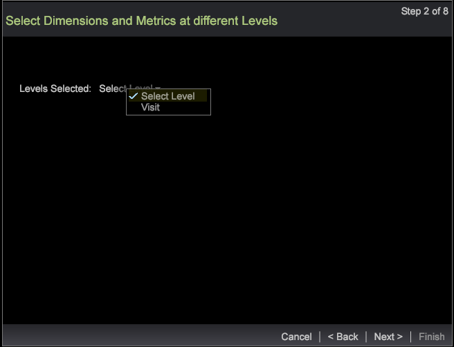

# 세그먼트 내보내기 마법사{#segment-export-wizard}

{{eol}}

세그먼트 내보내기 마법사를 사용하여 세그먼트 내보내기

세그먼트 내보내기 마법사 는 세그먼트가 아닌 세그먼트를 구성하고 내보내기 위한 단계별 프로세스를 제공합니다 [세부 사항 테이블에서 세그먼트 내보내기](https://experienceleague.adobe.com/docs/data-workbench/using/client/export-data/c-sgmt-expt.html).

## 마법사를 사용하여 세그먼트 내보내기 {#section-b30f2699dbc7490bad18512b91cb0cb3}

마법사를 열려면 작업 공간에서 마우스 오른쪽 단추를 클릭하고 을 선택합니다 **관리** > **마법사** > **세그먼트 내보내기 마법사**.

>[!NOTE]
>
>마법사를 열기 전에 적용된 세그먼트만 캡처됩니다. 또한 마법사에서 생성된 세그먼트 내보내기는 외부 명령을 생성할 수 없습니다.

1. 내보내기에 추가할 차원 및 지표의 다양한 상위 수준을 선택합니다.

   표시되는 수준은 선택한 프로필에 따라 다릅니다. 프로필을 기반으로 여러 차원 수준을 선택할 수 있습니다.

   

1. **다음**&#x200B;을 클릭합니다.
1. 선택한 수준에 대한 Dimension 및 지표를 선택합니다.

   예를 들어, 페이지 보기를 상위 수준으로 선택한 후 내보낼 수 있는 하위 차원 및 지표를 선택할 수 있습니다.

1. **다음**&#x200B;을 클릭합니다.

   

   

1. 내보내기 형식을 선택하고 내보내기 파일의 이름을 입력합니다.

   

   CSV, TSV, 세그먼트 내보내기 및 헤더 유형을 사용하여 세그먼트 내보내기를 별도의 구성할 필요가 없습니다. 하지만 프로필 및 대상 내보내기, 사용자 지정 레코드 서비스 및 Adobe Target 내보내기는 3단계에서 구성해야 합니다. 예를 들어 프로필 및 대상자 내보내기에 대한 구성 필드를 참조하십시오. 이러한 내보내기 유형을 구성하고 를 클릭합니다 **다음**.

   

   

   

1. 선택한 내보내기 유형을 구성합니다.

   헤더 - 헤더가 True이면 이름을 **출력 파일** 필드.

   이스케이프 필드(Escape Field) - 다음으로 설정 **True** 또는 **False**.

   필드 순서(Order of Fields) - 필드를 선택하고 위 또는 아래로 이동하여 내보내기 파일의 순서를 설정합니다.

   

   **다음**&#x200B;을 클릭합니다.

1. 이 대화 상자에서 수준 및 적용된 필터를 봅니다. **다음**&#x200B;을 클릭합니다. 

1. If **CSV**, **TSV**, **세그먼트 내보내기** 또는 **헤더로 세그먼트 내보내기** 이 선택되면 다음 세 가지 옵션이 있습니다.

   일반 내보내기 - 서버/내보내기 폴더의 서버에서 출력 파일을 생성합니다.

   

   FTP 내보내기 - 출력 파일이 선택한 서버로 전송됩니다. (서버의 목록이 FTPServerInfo.cfg 파일에서 선택됩니다.)

   

   SFTP 내보내기 - 출력 파일이 선택한 서버로 안전하게 전송됩니다.

1. **다음**&#x200B;을 클릭합니다

   **참고:** 선택한 내보내기 유형이 **프로필 및 대상자 내보내기**, **사용자 지정 레코드 서비스**, 및 **Adobe Target 내보내기**&#x200B;을 지정하면 선택한 내보내기에 따라 텍스트가 정적 상태가 됩니다.

1. 예약 매개 변수를 구성합니다.

   **한 샷** 를 True 또는 False로 설정할 수 있습니다.

   **고급 예약** 고급 예약 구성 단추를 클릭하여 설정 또는 해제할 수 있습니다.

   

   세부 정보 테이블에서 내보내기와 마찬가지로 고급 설정이 켜져 있으면 한 번의 샷이 사라집니다. **다음**&#x200B;을 클릭합니다.

1. 내보내기 파일을 미리 보고 를 클릭합니다 **내보내기 실행**.

   

   

마법사를 사용하여 다음 내보내기 유형을 사용할 수 있습니다.

**세그먼트 내보내기 유형**

* 범용
* FTP
* SFTP

**헤더로 세그먼트 내보내기**

* 범용
* FTP
* SFTP

**CSV 내보내기**

* 범용
* FTP
* SFTP

**TSV 내보내기**

* 범용
* FTP
* SFTP
