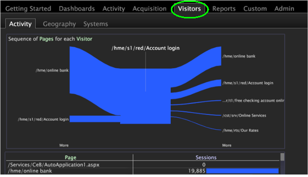
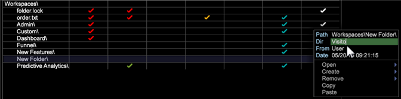

# worktop에 탭 추가{#add-a-tab-to-the-worktop}

작업 공간에 빠르게 액세스하려면 탭을 Worktop에 추가합니다.

작업공간에서 작업공간을 탭으로 추가할 수 있습니다. 예를 들어 트래픽 개요에 빠르게 액세스할 수 있는 **방문자** 탭을 추가할 수 있습니다.

**프로필 관리자에서 폴더 추가**

1. 새 탭과 연결할 작업 영역을 연 다음, **관리** > **프로필 관리자**&#x200B;를 마우스 오른쪽 단추로 클릭합니다.
1. [!DNL Profile Manager]에서 **[!UICONTROL Workspaces]**&#x200B;을 클릭하여 해당 콘텐츠를 봅니다.
1. [!DNL Workspaces]에 대한 [!DNL User] 열을 마우스 오른쪽 단추로 클릭하고 **[!UICONTROL Create]** > **[!UICONTROL Folder]**&#x200B;를 선택합니다.

   

   이렇게 하면 새 탭을 통해 사용할 파일을 포함하는 새 하위 폴더가 만들어집니다. 새 폴더라는 새 폴더가 나타납니다.
1. 이름을 바꾸려면 새 폴더의 [!DNL User] 열을 마우스 오른쪽 단추로 클릭하고 Dir 매개 변수에 이름을 입력합니다.

   

   폴더 이름이 worktop에 탭으로 표시됩니다.

   

1. (선택 사항) 작업 프로필의 모든 사용자가 변경 사항을 사용할 수 있도록 하려면 [!DNL User] 열에서 [!DNL .vw] 파일의 흰색 확인 표시를 마우스 오른쪽 단추로 클릭하고 **[!UICONTROL Save to]** > *&lt;**[!UICONTROL working profile name]*** 를 클릭합니다.

   이 작업 공간의 축소판이 아니라 전체 크기 버전의 설명 작업 영역만 표시하려면 작업 영역을 작업 프로필에 저장해야 합니다. 이렇게 하려면 [!DNL Profile Manager]에서 [!DNL User] 열의 [!DNL description.vw] 파일에 대한 흰색 확인 표시를 마우스 오른쪽 단추로 클릭한 다음 **[!UICONTROL Save to]** > *&lt;**[!UICONTROL working profile name]***&#x200B;를 클릭합니다.
