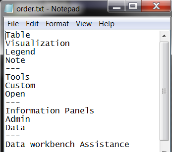

# order.txt 파일을 사용하여 메뉴 사용자 정의{#customize-a-menu-using-order-txt-files}

{{eol}}

해당 메뉴와 연관된 order.txt 파일을 편집하여 메뉴 모양을 사용자 정의할 수 있습니다.

이 섹션의 단계는 모든 유형의 메뉴에 적용됩니다.

**메뉴를 사용자 정의할 order.txt 파일을 편집하려면**

1. 에서 [!DNL Profile Manager]에서 *프로필 이름* 열에서 [!DNL order.txt] 를 클릭하고 **[!UICONTROL Make Local]**.
1. 에 대한 확인 표시를 마우스 오른쪽 단추로 클릭합니다. [!DNL order.txt] 파일의 [!DNL User] 열 및 클릭 **[!UICONTROL Open]** > **[!UICONTROL in Notepad]**. 다음 [!DNL order.txt] 파일이 표시됩니다.

   

1. (선택 사항) [포함] 또는 [제외] 원하는 경우 파일의 상단에 을 설정합니다. 이 설정은 항목이 [!DNL order.txt] 파일에 있음 [!DNL Profile Manager] 이 메뉴에 나열됩니다. 옵션은 다음과 같습니다.

   * **[포함]:** 기본 설정입니다. 이 설정은 [!DNL order.txt]메뉴 하단에 알파벳 순서로 나열되는 파일입니다. 예를 들어 [!DNL Profile Manager] 에는 [!DNL order.txt] 위의 프로필은 데이터 아래에 표시됩니다.

   * **[제외]:** 이 설정은 [!DNL order.txt] 메뉴에서 제외할 파일입니다. 예를 들어 [!DNL Profile Manager] 에는 [!DNL order.txt] 위의 경우에는 메뉴 어디에나 프로필이 표시되지 않습니다.

   * **공백:** 둘 중 어느 것도 아니면 [포함] 또는 [제외] 파일의 맨 위에 나타나는 경우 Data Workbench에 메뉴 항목이 설정 그대로 표시됩니다 [포함].

1. 다음 단계 중 하나 이상을 완료합니다.

   <table id="table_C5D5313DF5E4470499B0B285BA2690F0"> 
    <thead> 
    <tr> 
    <th colname="col1" class="entry"> 이 작업을 수행하려면... </th> 
    <th colname="col2" class="entry"> 다음을 수행합니다... </th> 
    </tr> 
    </thead>
    <tbody> 
    <tr> 
    <td colname="col1"> 
메뉴 항목 순서 조정 
 </td> 
    <td colname="col2"> 
Data Workbench에 표시할 순서대로 항목 이름을 입력합니다. 
 
예를 들어 각 메뉴 항목 이름이 해당 파일 또는 폴더 이름과 일치하는 경우 다음과 같은 결과가 발생합니다<b> 표 추가</b> 먼저 나타나고 <b>시각화 추가</b>, <b>범례 추가</b>, 및 <b>메모 추가</b> 마지막으로 표시됩니다. 
 
<b>표 추가 </b> 
 
<b>시각화 추가 </b> 
 
<b>범례 추가 </b> 
 
<b>메모 추가 </b> 
 </td> 
    </tr> 
    <tr> 
    <td colname="col1"> 
메뉴 항목 이름 바꾸기 
 </td> 
    <td colname="col2"> 
에서 해당 파일 또는 폴더의 이름을 변경합니다  프로필 관리자를 입력한 다음  order.txt 파일. 
 
예를 들어, 주석 추가를 새 주석으로 변경하려면  프로필 관리자 새 주석으로 이동한 다음,  order.txt 파일을 새 주석에 추가합니다. 
 </td> 
    </tr> 
    <tr> 
    <td colname="col1"> 
메뉴 항목 숨기기 
 </td> 
    <td colname="col2"> 
메뉴 항목을 숨기지만 항목 자체를 삭제하지 않으려면 해당 이름의 시작 부분에 빼기 기호(-)를 입력합니다. 
 
예를 들어, 다음 결과는  주석 추가 메뉴에 표시되지 않습니다. 
 
범례 추가 
 
-주석 추가 
 
숨겨진 메뉴 항목을 다시 표시하려면 빼기 기호(-)를 제거하거나  Insight.cfg 파일, <a href="../../../../home/c-get-started/c-insght-config-param.md#concept-14da97d0756348e885c08ca9e866074b"> 인사이트 구성 매개 변수</a>. 
 
다음 방법을 사용하여 메뉴 항목을 숨길 수도 있습니다. 
    <ul id="ul_CC9A82AFCE784CA49CC912C9256BAC1A"> 
    <li id="li_28C28CA0DE4B4A8F9C2C2C2B3BDD0557"> 
에 있는 Show 매개 변수  .filter,  .metric, 또는  .dim 파일은 해당 메뉴에서 필터, 파생된 지표 및 차원 및 확장 차원을 숨깁니다. 이 옵션을 사용할 때 항목은 메뉴에 나열되지 않지만 여전히 프로필에 있으며 사용할 수 있습니다. 
 
이 매개 변수를 사용하여 필터, 파생된 지표 및 차원을 숨기려면 다음 줄을 의 끝에 추가하십시오  .metric,  .dim, 또는  .filter 파일: 
 
 show = bool: false 
 
이 매개 변수를 사용하여 확장 차원을 숨기려면 <i>데이터 집합 구성 안내서</i> 참조하십시오. 
 
에서 Unhide All 매개 변수를 설정하여 이 메서드를 사용하여 숨겨진 항목의 숨김을 일시적으로 해제할 수 있습니다  Insight.cfg 파일. 이 매개 변수에 대한 자세한 내용은 <a href="../../../../home/c-get-started/c-insght-config-param.md#concept-14da97d0756348e885c08ca9e866074b"> 인사이트 구성 매개 변수</a>. 
 </li> 
    <li id="li_2CB65D594DD04C59A8D27A17DBF278FA">의 Hidden 매개 변수  Transformation.cfg 파일 또는 데이터 세트 포함 파일은 차원 메뉴에서 확장 차원을 숨깁니다. 이 옵션을 사용할 때 항목은 메뉴에 나열되지 않지만 여전히 프로필에 있으며 사용할 수 있습니다. 
 
참고: 이 방법을 사용하여 확장 차원을 숨길 때 차원을 숨기려면 데이터 세트를 다시 변형해야 합니다. 
 
 
에서 Unhide All 매개 변수를 설정하여 이 메서드를 사용하여 숨겨진 항목의 숨김을 일시적으로 해제할 수 있습니다  Insight.cfg 파일. 이 매개 변수에 대한 자세한 내용은 <a href="../../../../home/c-get-started/c-insght-config-param.md#concept-14da97d0756348e885c08ca9e866074b"> 인사이트 구성 매개 변수</a>. 
 </li> 
    <li id="li_6E161953FEA44EC18237D88D7173DC60"> 
0바이트 파일은 메뉴에서 모든 유형의 항목을 숨깁니다. 이 옵션을 사용하는 경우 빈(0바이트) 파일은 데이터를 포함하는 것과 동일한 이름의 파일이 있는지 숨깁니다. Data Workbench은 0바이트 파일을 존재하지 않는 것처럼 처리합니다. 자세한 내용은 <a href="../../../../home/c-get-started/c-admin-intrf/c-prof-mgr/c-empty-files.md#concept-e776fac9e5904bed8c13b9d5eb17c491"> 빈(0바이트) 파일을 사용하여 파일 숨기기</a>. 
 </li> 
    </ul> 
 </td> 
    </tr> 
    <tr> 
    <td colname="col1"> 
메뉴 항목 삭제 
 </td> 
    <td colname="col2"> 
이 파일이 [Exclusive] 옵션을 사용하도록 설정된 경우 이 파일에서 메뉴 항목을 삭제하면 됩니다. 항목 자체는 여전히 프로필에 있지만 메뉴에 나열되지 않습니다. 
 
이 파일이 [포함] 옵션을 사용하도록 설정된 경우 이 파일에서 메뉴 항목 이름을 제거하고 해당 파일을 삭제하거나 0바이트로 클릭하여 메뉴에서 항목을 제거해야 합니다. 
 
파일 삭제에 대한 자세한 내용은 <a href="../../../../home/c-get-started/c-admin-intrf/c-prof-mgr/t-del-files-wkg-prof.md#task-1e29c25e6c824cc9b51cb651e835856b"> 작업 프로필에서 파일 삭제</a>. 0바이트 파일에 대한 자세한 내용은 <a href="../../../../home/c-get-started/c-admin-intrf/c-prof-mgr/c-empty-files.md#concept-e776fac9e5904bed8c13b9d5eb17c491"> 빈(0바이트) 파일을 사용하여 파일 숨기기</a>. 
 </td> 
    </tr> 
    <tr> 
    <td colname="col1"> 
그룹 헤더 추가 
 </td> 
    <td colname="col2"> 
표시할 제목 텍스트 앞과 뒤에 하이픈 세 개를 입력합니다. 
 
예를 들어, 다음과 같은 경우 관련 메뉴 항목 집합에 대한 그룹 헤더 관리가 발생합니다. 
 
---관리--- 
 
프로필 
 
데이터 세트 
 
  </img> 
 </td> 
    </tr> 
    <tr> 
    <td colname="col1"> 
메뉴의 개별 섹션에 선 추가 
 </td> 
    <td colname="col2"> 
선을 표시할 하이픈 세 개를 입력합니다. 
 
예를 들어, 다음 작업으로 인해 주석 추가 및 사용자 정의 추가 가 구분되는 선이 생깁니다. 
 
주석 추가 
 
— 
 
사용자 지정 추가 
 </td> 
    </tr> 
    </tbody> 
    </table>

1. 파일을 저장하고 닫습니다.
1. (선택 사항) 작업 프로필의 모든 사용자가 변경 사항을 사용할 수 있도록 하려면 [!DNL order.txt] 파일의 [!DNL User] 열 및 클릭 **[!UICONTROL Save to]** > * **[!UICONTROL working profile name]**.
