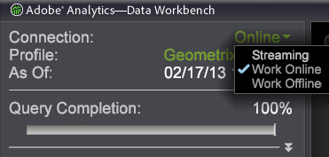

# 오프라인 및 온라인 작업{#working-offline-and-online}

Data Workbench 서버를 오프라인 또는 온라인으로 작업하는 방법에 대한 정보입니다.

[!DNL server]에 네트워크에 연결되어 있고 온라인으로 작업 중인 경우 Data Workbench은 프로파일 및 해당 데이터에 대한 업데이트를 Data Workbench 서버에서 자동으로 다운로드합니다. 온라인으로 작업하도록 지정하지 않은 경우 Data Workbench은 컴퓨터의 캐시에서 프로필과 해당 데이터를 로드합니다. 이 경우 프로필의 버전과 마지막으로 프로필로 온라인으로 작업한 후 다운로드한 해당 데이터를 보고 있습니다.

로컬 캐시에서 작업하고 자신의 컴퓨터에서 데이터를 쿼리하는 중이기 때문에 오프라인으로 작업하면 처리 속도 이점이 있습니다. 온라인 작업 시 모든 쿼리는 Data Workbench 서버로 돌아가므로 시간이 더 오래 걸리고 서버 리소스를 위해 다른 온라인 사용자와 경쟁해야 합니다. Data Workbench 서버에 네트워크 연결이 있는 한, 오프라인으로 작업하면 Data Workbench 서버가 Data Workbench의 프로필 또는 데이터를 업데이트하지 못하게 되지만 Data Workbench 서버에 항목을 저장하는 것을 막지 않습니다.

오프라인으로 작업할 수 있기 때문에 Data Workbench 서버는 몇 명의 Data Workbench 사용자와 함께 데이터 세트에 있는 약간의 실시간 트래픽 입력 및 데이터 양을 처리할 수 있도록 크기가 조절되지만 최대 동시 사용자 수(실제로 자주 발생하지 않음)를 지원하기 위해 크기를 조정할 필요가 없습니다. 사용자는 일반적으로 트렌드와 비율을 찾고 있으므로 이동 중에도 데이터를 검색하며 대부분의 경우 정확한 카운트가 필요하지 않습니다. 현재 데이터를 사용하여 정확한 수를 확인하고 쿼리해야 할 필요가 있는 경우 온라인으로 작업하여 확인할 수 있지만 쿼리를 확인하는 데 시간이 오래 걸립니다.

**온라인 또는 오프라인으로 작업하려면**

사이드 바에서 **[!UICONTROL Connection]** 설정을 클릭하고 **[!UICONTROL Work Online]**&#x200B;을 클릭합니다.



온라인으로 작업할 때 Data Workbench은 Data Workbench 서버에 연결하여 컴퓨터의 정보를 Data Workbench 서버에 있는 프로파일 및 데이터 세트 정보와 동기화합니다.

Data Workbench의 기본 구성은 오프라인으로 작업하지만, 다음 섹션에 설명된 대로 각 사용자는 [!DNL Insight.cfg] 파일을 변경하여 Data Workbench 인스턴스를 기본적으로 온라인으로 사용할 수 있습니다.

**기본적으로 온라인으로 작업하려면**

1. Insight 설치 디렉토리로 이동합니다.
1. 텍스트 편집기에서 [!DNL Insight.cfg] 파일을 엽니다.
1. 다음 예제와 같이 강조 표시된 줄을 파일에 추가합니다.

```
Update Software = bool: true
Default to Online = bool: true
Color Set = int: 0
```

다음에 Data Workbench을 열면 Data Workbench 서버에 연결되고 기본적으로 온라인으로 작동합니다.
