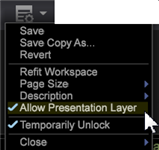
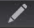

# 시각화에 주석 달기{#annotating-visualizations}

{{eol}}

프레젠테이션 레이어를 사용하면 작업 공간 시각화를 표시하고 주석을 다는 작업을 수행한 다음 설명서와 주석으로 게시할 수 있습니다. 텍스트 설명, 그래픽 객체, 설명선 화살표, 색상 코딩, 이미지 및 기타 기능을 오버레이에 추가하여 주석을 추가하고 중요한 데이터 포인트를 명확히 한 다음 이해 관계자와 공유합니다.

**시각화에 주석 추가:**

1. 작업 공간을 엽니다.
1. 이동 **파일** > **프레젠테이션 레이어**.
1. 클릭 **프레젠테이션 레이어 허용**.

   이 메뉴에서 명령을 전환하여 프레젠테이션 레이어 생성을 허용하거나 허용하지 않습니다. 프레젠테이션 레이어가 허용되면 확인 표시가 나타납니다.

   

   프레젠테이션 레이어를 허용하면 도구 모음 오른쪽에 클릭 가능한 아이콘이 나타납니다.

    이 클릭 가능한 아이콘은 **프레젠테이션 레이어 숨기기** 모드 로 설정되지만 주석을 볼 수 없습니다.

1. 아이콘을 클릭하여 **프레젠테이션 레이어 표시**.

   프레젠테이션 레이어에서 주석 보기

    이 클릭 가능한 아이콘은 **프레젠테이션 레이어 표시** 모드를 편집할 수 없습니다.

   >[!NOTE]
   >
   >작업공간에서 마우스 오른쪽 단추를 클릭하여 메뉴 명령을 사용하여 모드를 변경할 수도 있습니다.

   

1. **설명선 피쳐를 편집하고 추가합니다.**

   아이콘을 다시 클릭하여 작업 공간 시각화의 정적 표현을 캡처하고 오버레이를 열어 주석을 추가하거나 편집합니다.

    이 클릭 가능한 아이콘은 **프레젠테이션 레이어 편집** 주석 추가 및 편집 모드.

   편집 모드에 있는 동안 회색 오버레이가 나타납니다.

1. **설명선 기능 추가**.

   시각화를 마우스 오른쪽 단추로 클릭하여 새 텍스트 상자를 추가합니다. 프레젠테이션에 대해 강조표시하고 주석을 달 수 있는 화살표 및 기타 설명선 피쳐.

   

1. **그래픽 기능 설정**.

   그래픽 객체를 선택하고 마우스 오른쪽 버튼을 클릭하여 옵션을 설정합니다. 상자나 다른 그래픽 객체의 색상을 설정하고, 텍스트 상자에서 텍스트 설정을 조정하고, 화살표를 추가하거나 선에 대한 레이어링을 설정할 수 있습니다.

   

1. **작업 공간에 이미지 추가**.

   마우스 오른쪽 단추를 클릭하여 .jpg 이미지를 오버레이에 추가하고 크기를 조정합니다.

1. **그래픽 객체에 색상 할당**.

   프레젠테이션 레이어에서 개체를 선택하고 색상 선택기를 사용하여 색상을 지정할 수 있습니다. 

1. **프레젠테이션 레이어 내보내기 및 공유**.

   작업 공간 시각화에 주석을 달 때 시각화를 사용하여 프레젠테이션 레이어를 내보내고 .png 그래픽 파일로 공유할 수 있습니다.

   클릭 **내보내기** > **PNG 내보내기**.
