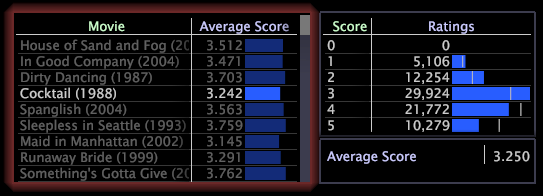

# 시각화에서 선택{#make-selections-in-visualizations}

시각화 내에서 요소를 선택하면 데이터 세트가 동적으로 필터링됩니다.

시각화에서 항목을 선택하면 작업 공간의 다른 모든 시각화는 선택한 요소와 관련된 데이터만 반영하도록 자동으로 업데이트됩니다.

다음 작업 영역에는 동영상 *Cocktail*&#x200B;이 선택된 동영상 테이블이 표시됩니다. 작업 공간에서 [점수] 테이블과 지표 범례는 선택한 요소에 대한 표시를 자동으로 필터링합니다. 즉, 이 표는 동영상 *Cocktail*&#x200B;에 대한 데이터를 반영합니다.

위의 예에서 보듯이, 선택을 수행하면 시각화 및 해당 시각화 내에서 선택되지 않은 요소 주위에 광선이 표시됩니다. 전체 데이터 세트에 대한 비교를 용이하게 하기 위해 막대 그래프에 벤치마크라고 하는 좁은 흰색 선이 나타나 필터링되지 않은 원본 데이터의 모양을 표시합니다. 벤치마크에 대한 자세한 내용은 [벤치마크 이해](../../../../home/c-get-started/c-vis/c-ustd-benchmks.md#concept-c7b0f4102e92458096f8c4765cbe2914)를 참조하십시오.

**선택 영역을 만들려면**

산포도와 범례를 제외한 하나 이상의 차원을 표시하는 모든 시각화에서 선택할 수 있습니다.

다음 마우스 및 키 시퀀스를 사용하여 원하는 요소를 선택합니다.

| 종료... | 이 시퀀스 사용... |
|---|---|
| 단일 요소 선택 | 확대/축소한 후에  |
| 요소 범위 선택 | 클릭+드래그 |
| 현재 선택 영역에 요소 추가 | Ctrl+클릭 |
| 단일 선택 항목 지우기 | Shift+클릭 |
| 모든 선택 항목 지우기(즉, 모든 요소를 다시 선택) | 시각화에서 값을 마우스 오른쪽 단추로 클릭합니다. |

**선택 영역을 지우려면**

다음 마우스 및 키 시퀀스를 사용하여 선택 영역을 지웁니다.

| 종료 | 이 시퀀스 사용... |
|---|---|
| 단일 선택 항목 지우기 | Shift+클릭 |
| 모든 선택 항목 지우기(즉, 모든 요소를 다시 선택) | 시각화에서 값을 마우스 오른쪽 단추로 클릭합니다. |
