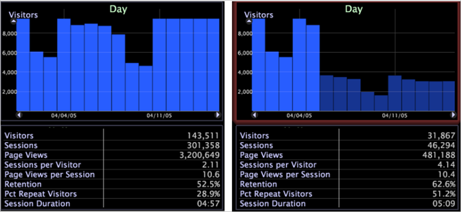

# 하위 세트 이해{#understanding-subsets}

하위 집합에 대한 개념 정보입니다.

하위 집합을 사용할 때는 다음 사항에 유의하십시오.

* 이제 모든 벤치마크 테스트는 전체 데이터 세트가 아니라 하위 집합과 관련되어 있으며 특정 하위 집합을 분석할 때 더욱 유용합니다. 벤치마크 [이해를 참조하십시오](../../../../home/c-get-started/c-vis/c-ustd-benchmks.md#concept-c7b0f4102e92458096f8c4765cbe2914).
* 하위 세트를 사용하면 하위 세트가 데이터 워크벤치에 전역으로 적용되므로 모든 작업 영역에 영향을 줍니다.
* 하위 세트는 일반 차원이 아니라 지표와 비정상 차원에만 영향을 줍니다.
* 사용 [!DNL Report]시 하위 세트는 다른 사람이 볼 수 있도록 게시한 보고서의 데이터에 영향을 주지 않습니다.
* 적용된 하위 세트는 다음에 이 Data Workbench 인스턴스를 열 때를 비롯하여, 프로필의 모든 후속 작업에 대해 적용되며, 이 하위 세트는 제거할 때까지 실행됩니다.
* 하위 세트가 적용되었음을 나타내는 유일한 위치는 작업 공간 내에서 마우스 오른쪽 단추를 클릭하여 액세스할 수 있는 컨텍스트 메뉴입니다.

   

* 하위 집합을 변경하거나 제거하려면 온라인으로 작업해야 합니다. 오프라인 작업 중에 하위 세트를 적용한 경우 전체 데이터 세트에서 결과를 볼 수 없습니다. 오프라인 [및 온라인 작업을 참조하십시오](../../../../home/c-get-started/c-off-on.md#concept-cef8758ede044b18b3558376c5eb9f54).

   >[!NOTE]
   >
   >하위 집합의 크기는 단일 데이터 워크벤치 서버에 있는 필터의 데이터 양으로 제한됩니다. 따라서 데이터 세트에 데이터 워크벤치 서버 클러스터가 걸쳐 있는 경우 하위 세트에 대한 데이터는 클러스터의 한 데이터 워크벤치 서버에서만 가져옵니다.

대규모 소매점의 사용자는 특정 작업 주의 데이터의 하위 집합(로컬 캐시)을 만든 다음 해당 데이터 주에 대해서만 쿼리를 실행하려고 합니다. 이렇게 하려면 사용자가 관심 기간 동안 하위 집합을 만듭니다.

다음 예는 시간에 따른 방문자 막대 그래프와 트래픽 지표 범례를 보여줍니다. 첫 번째 그림에는 선택 사항이 없습니다.데이터 세트에 있는 모든 데이터가 표시됩니다. 두 번째 그림은 방문자의 일 수 = {...} 하위 집합에 대한 데이터를 보여줍니다. 이 데이터는 일 차원에서 4월 1일부터 4월 5일까지 요소 선택을 기반으로 합니다.

