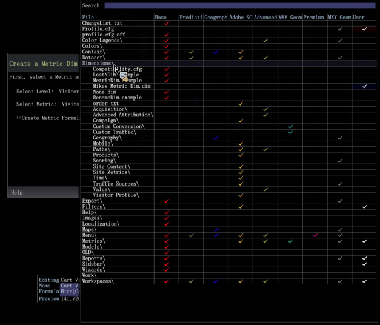
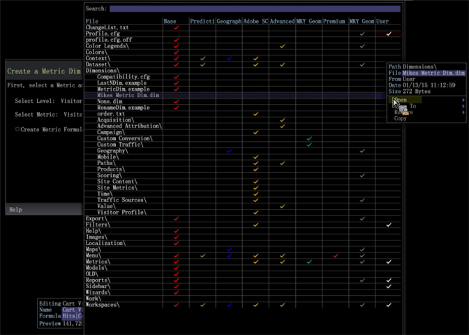

# 지표 치수 편집{#editing-the-metric-dim}

{{eol}}

프로필 관리자에서 지표 치수 편집

기존 지표 치수 편집하려면

1. 작업 공간에서 마우스 오른쪽 단추 클릭 **관리** > **프로필 관리자**. 열기 **Dimension** 지표를 치수(dim)로 선택합니다. 

1. 사용자 열에서 확인 표시를 마우스 오른쪽 단추로 클릭하고 **열기** 그런 다음 지표 치수 를 선택합니다. 

1. 지표 치수 편집 상자에서 필요에 따라 변경합니다. 
