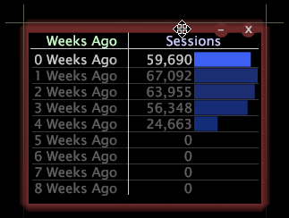

# 작업 영역에서 창 조작{#manipulate-windows-in-a-workspace}

{{eol}}

사용 가능한 창 유형은 작업 중인 프로필 및 응용 프로그램에 따라 다릅니다.

**창을 추가하려면**

1. 작업 공간에서 마우스 오른쪽 단추를 클릭하고 원하는 메뉴 옵션을 클릭합니다.
1. 나타나는 메뉴에서 보려는 창 유형을 선택합니다.

**창을 이동하려면**

마우스 포인터를 창 위쪽 테두리에 두고 네 개의 화살표가 될 때까지 누른 다음 클릭+드래그하여 작업 영역에서 원하는 위치로 드래그합니다.

**창의 크기를 조정하려면**

창의 측면 또는 모서리에 마우스 포인터를 놓고 두 개의 화살표가 될 때까지 창 모서리나 측면을 클릭+드래그하여 창을 원하는 크기로 만듭니다.

**창을 복사하여 붙여넣으려면**

작업 공간 내 및 작업 공간 간에 창을 복사하고 붙여넣을 수 있습니다.

1. 창의 위쪽 테두리를 마우스 오른쪽 단추로 클릭하고 **[!UICONTROL Copy]** > **[!UICONTROL Window]**.
1. 원하는 작업 영역에서 을 클릭합니다 **[!UICONTROL Open]** > **[!UICONTROL From Clipboard]**.

**창을 시각화를 위한 설명선으로 복사하여 붙여넣으려면**

1. 창의 위쪽 테두리를 마우스 오른쪽 단추로 클릭하고 **[!UICONTROL Copy]** > **[!UICONTROL Window]**.
1. 원하는 시각화에서 원하는 요소를 마우스 오른쪽 단추로 클릭하고 를 클릭합니다 **[!UICONTROL Add Callout]** > **[!UICONTROL From Clipboard]**.
