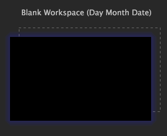
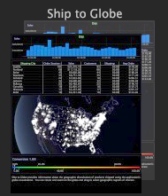

# 작업 영역 만들기{#create-a-workspace}

기존 시각화를 추가 또는 수정하거나 새 작업 영역을 만들어 기존 작업 영역을 사용자 정의할 수 있습니다.

그런 다음 나중에 사용할 수 있도록 이러한 작업 영역을 저장할 수 있습니다. 작업 [영역 만들기를 참조하십시오](../../../home/c-get-started/c-work-worksp/c-create-worksp.md#concept-d8bc99d7739e4eaeab2a02b022394a31).

빈 작업 영역을 만들거나, 기존 작업 영역을 복사하여 붙여넣거나, 작업 영역을 다른 위치에 저장하거나, 다른 이름을 사용하여 새 작업 영역을 만들 수 있습니다.

이 섹션에서는 다음 작업에 대해 설명합니다.

* [새 작업 영역 추가](../../../home/c-get-started/c-work-worksp/c-create-worksp.md#section-4236ae30e2884ea08f0885bf329f0778)
* [기존 작업 영역 복사 및 붙여넣기](../../../home/c-get-started/c-work-worksp/c-create-worksp.md#section-f91ae89b845640c9a4a52820a6110e65)
* [작업 영역 이름 변경](../../../home/c-get-started/c-work-worksp/c-create-worksp.md#section-ca7edb913e4e4630a856f45a2536ffad)

## 새 작업 영역 추가 {#section-4236ae30e2884ea08f0885bf329f0778}

원하는 [!DNL Worktop] 탭에서 탭 내의 빈 영역을 마우스 오른쪽 단추로 클릭하고 다음 옵션 중 하나를 클릭합니다.

* **[!UICONTROL New]** > **[!UICONTROL Blank Workspace]**. 이 옵션은 표준 크기 빈 작업 영역을 표시합니다.

* **[!UICONTROL New]** > **[!UICONTROL Report Template]**. 이 옵션은 보고서를 만드는 데 사용할 수 있는 표준 크기 템플릿을 표시합니다.

새로운 유형의 작업 영역에 대한 축소판이 탭에 나타납니다.

>[!NOTE]
>
>새 작업 영역을 연 후 추가 > 임시 잠금 **해제를** 클릭해야 **할 수 있습니다**.

## 기존 작업 영역 복사 및 붙여넣기 {#section-f91ae89b845640c9a4a52820a6110e65}

기존 작업 영역을 복사하여 다른 작업 영역에 붙여넣을 수 있습니다. 같은 이름의 작업 영역의 서버 버전이 포함된 탭에 작업 영역을 붙여 넣으면 작업 영역이 해당 작업 영역의 로컬 버전으로 붙여넣기가 됩니다. 동일한 이름의 작업 영역의 서버 및 로컬 버전이 들어 있는 탭에 작업 영역을 붙여 넣으면 작업 영역이 동일한 이름의 해당 작업 영역의 사용자 버전으로 붙여넣기가 됩니다(복사). 동일한 이름의 작업 영역이 없는 탭에 작업 영역을 붙여 넣으면 작업 영역이 새 사용자 작업 영역으로 붙여넣게 됩니다.

**기존 작업 영역을 복사하여 붙여넣으려면**

1. 원하는 [!DNL Worktop] 탭에서 복사할 작업 영역을 마우스 오른쪽 단추로 클릭하고 **[!UICONTROL Copy]**&#x200B;클릭합니다.

   

1. 작업 영역을 붙여넣을 탭으로 이동한 다음 탭 내의 빈 영역을 마우스 오른쪽 단추로 클릭한 다음 을 클릭합니다 **[!UICONTROL Paste]**.

   다음 예제는 서버 버전을 포함하는 작업 영역 탭에 붙여넣은 작업 공간입니다.

   

다음 예제는 이미 서버와 로컬 버전이 들어 있는 작업 영역 탭에 붙여넣은 작업 공간입니다. 작업 영역은 동일한 이름의 해당 작업 영역의 사용자 버전으로 붙여넣기되고 (복사)

## 작업 영역 이름 변경 {#section-ca7edb913e4e4630a856f45a2536ffad}

**작업 영역의 이름을 변경하려면**

1. 원하는 [!DNL Worktop] 탭에서 표시할 작업 영역의 축소판을 클릭합니다.
1. 다음 예와 같이 작업 영역에서 제목 표시줄의 제목 텍스트를 클릭하고 새 제목을 입력합니다.

   

## 작업 영역 삭제 {#section-fb04cc195e1a4a5491ff634f5f3ca972}

**작업 영역의 이름을 변경하려면**
