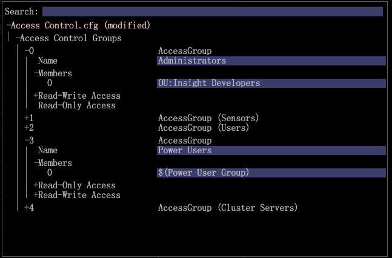

# 그룹 구성원 액세스에 대한 사용자 관리{#user-administration-of-group-member-access}

{{eol}}

관리자는 워크스테이션 사용자에게 사용자 지정 그룹에 대한 액세스 제어를 관리할 수 있는 능력을 부분적으로 제공할 수 있습니다.

**그룹 구성원 액세스에 대한 자체 관리** 사용자 지정 그룹에서 구성원을 추가 및 삭제할 수 있는 관리자가 아닌 사용자에게 권한을 제공합니다. 관리자는 **사용자 목록** 파일에서 그룹 액세스를 설정하고 [Access Control.cfg](https://experienceleague.adobe.com/docs/data-workbench/using/server-admin-install/admin-dwb-server/access-control/c-config-acs-ctrl.html) 새 그룹 구성원의 파일입니다.

**서버 관리자 액세스**

설정 **[!DNL User List]** 파일 및 와 동기화 **[!DNL Communications.cfg]** 파일에서 **서버 관리자** 작업 공간.

1. worktop에서 **관리** 탭 > **데이터 집합 및 프로필** 탭.

1. 를 엽니다. **서버 관리자** 작업 공간.
1. 마우스 오른쪽 단추 클릭 >*서버 이름*> 를 선택하고 **파일**.

   서버 파일이 열이 있는 테이블에서 열립니다 *파일*, *`<server name>`*, 및 *임시*.

1. **로컬 만들기** 서버 파일의 서버 열을 마우스 오른쪽 단추로 클릭하여 **[!DNL Access Control]** 및 **[!DNL Components/Communications.cfg)]**.

   에 흰색 확인 표시가 나타납니다 **임시** 열. 임시 폴더에서 편집할 수 있습니다. 그런 다음 확인 표시를 마우스 오른쪽 단추로 클릭하고 **저장 위치** 서버. (서버와 동기화되면 빨간색으로 바뀝니다.)

## User List.cfg 파일 만들기 {#section-c25bcaf34f4546e6b8b65f5e7f69ac09}

관리자는 **[!DNL User List.cfg]** 파일의 **[!DNL Access Control]** 폴더를 입력합니다.

1. 에서** Access Control** 행을 마우스 오른쪽 단추로 클릭합니다. **임시** 열 및 선택 **열기** > **폴더**. 

   의 Access Control 폴더 **임시** 폴더가 열려 단일 목록 **[!DNL Access Control.cfg]** 파일.

1. 이 폴더에 다른 텍스트 파일을 추가하고 이름을 지정합니다 **[!DNL User List.cfg]** (다음 **[!DNL Access Control.cfg]**).

1. 다음 매개 변수를 **[!DNL User List.cfg]** 파일.

사용자 목록 파일에는 **AccessGroup** 개체 및 각 **AccessGroup** 객체에는 라는 이름과 문자열 벡터가 있어야 합니다. **멤버**.

```
Access Control Groups = vector: 1 items 
  0 = AccessGroup:  
    Name = string: Group 1 
    Members = vector: 1 items 
      0 = string: CN:Joe User
```

그런 다음 의 워크스테이션 보기에서 사용자를 편집하고 추가할 수 **[!DNL User List.cfg]**파일.


여기에 추가할 가장 기본적인 매개 변수가 있습니다 **[!DNL User List.cfg]** 파일. 그런 다음 워크스테이션 보기에 구성원을 추가할 수 있습니다.

```
Access Control Groups = vector: 1 items 
  0 = AccessGroup:  
    Name = string:  
    Members = vector: 0 items
```

>[!IMPORTANT]
>
>다른 어떤 것과도 마찬가지로 **[!DNL .cfg]** 수동으로 편집하는 파일에서 탭 대신 공백을 사용하고 공백 및 구문에 주의를 기울여야 합니다. 이 파일의 실수로 인해 *Adobe Insight 서버* 사용자 목록 파일을 무시합니다.

다음 **이름** 각 필드 **액세스 그룹** 는 [!DNL Access Control.cfg] 파일.

>[!NOTE]
>
>디렉터리 서비스 접두사가 있는 유효한 멤버만(예: ) **CN:** 또는 **OU:** 사용할 수 있으며 와일드카드 문자(&#42;).

## Communications.cfg 파일 설정 {#section-9d6f05ba81c14f15be63e361533459e8}

관리자는 먼저 **[!DNL Components]>[!DNL Communications.cfg]** 파일 및 이름을 사용하여 새 키 추가 **[!DNL Access Control User List File]**. 이 키의 문자열 값은 이 새 파일이 위치할 경로입니다.

1. 서버 파일에서 **구성 요소** 서버 열의 확인 표시를 마우스 오른쪽 단추로 클릭합니다. 클릭 **로컬 만들기**.

   에 흰색 확인 표시가 나타납니다 **임시** 열.

1. 에서 확인 표시를 마우스 오른쪽 단추로 클릭합니다. **임시** 열 및 선택 **열기** > **워크스테이션**.

1. 에서 **Communication.cfg** 파일, 마우스 오른쪽 단추 클릭 **구성 요소** 을(를) 선택합니다. **사용자 지정 키를 추가합니다.** 

1. 을(를) 입력합니다 **이름** 로서의 *액세스 제어 사용자 목록 파일* 및 설정 **유형** 로서의 *문자열*.

   >[!NOTE]
   >
   >새 목록 파일을 경로로 만들 수 없습니다. 이 문제를 해결하려면 파일을 저장하고 편집기(메모장)에서 파일을 열고 &quot;String&quot;을 &quot;Path&quot;로 변경해야 합니다.

   :

   ```
   component = CommServer:  
     Access Control File = Path: Access Control\\Access Control.cfg 
     Access Control User List File =  
    <string>: Access Control\\User List.cfg
   ```

   후:

   ```
   component = CommServer:  
     Access Control File = Path: Access Control\\Access Control.cfg 
     Access Control User List File =  
    <Path>: Access Control\\User List.cfg
   ```

1. 를 저장합니다 **[!DNL Communications.cfg]** 파일 및 (필요한 경우) 서버에 저장합니다. 이렇게 하면 서버에서 구성 요소가 다시 시작되어 오류가 발생하지 않도록 합니다 **[!DNL Communications.cfg]** 파일을 구문 분석하지 않습니다.
1. 시스템에 처리 서버가 포함되어 있는 경우 **[!DNL Components for Processing Servers.cfg]** 파일.
1. 마우스 오른쪽 단추 클릭 **[!DNL Communications.cfg]** 서버에 저장합니다.

이제 Data Workbench 관리자는 의도한 사용자가 사용자 목록 파일에 액세스할 수 있는지 확인하고 사용자가 그룹을 관리할 수 있도록 허용할 수 있습니다. 사용자는 필요에 따라 사용자 목록 파일을 열고 편집하고 CN 또는 OU 구성원을 추가 및 제거할 수 있습니다.

## Access Control.cfg 파일 동기화 {#section-ca6da453dfb4432bb40b86ef15ede872}

그런 다음 관리자가 **[!DNL Access Control.cfg]** 및에서 정의한 그룹에 대한 참조를 삽입합니다. *사용자 목록* 파일.

그룹에 대한 참조는 다른 멤버처럼 삽입되어야 하지만 다음 구문을 사용해야 합니다.

```
$(Group Name)
```

여기서 &quot;그룹 이름&quot;은 공백을 포함하여 사용자 목록 파일에 정의된 내용과 일치합니다. 

이 시점에서 Data Workbench 관리자는 그룹 사용자를 선택하여 사용자 목록 파일에 액세스할 수 있는지 확인할 수 있습니다. 그런 다음 사용자 선택에서 **[!DNL User List.cfg]** 필요에 따라 파일을 편집하고 CN 또는 OU 구성원을 추가 및 제거합니다.
