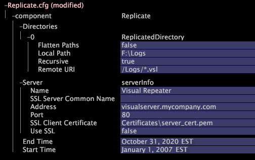

# 복제 서비스 구성{#configuring-the-replication-service}

원래 이벤트 데이터가 저장되는 반복기에서 데이터를 검색하도록 대상 Insight 서버를 구성해야 합니다.

[!DNL Repeater]에서 대상 [!DNL Insight Server]에 대한 데이터 검색을 구성하려면 다음 절차에 설명된 대로 대상 [!DNL Insight Server(s)]의 [!DNL Components] 폴더에 제공된 [!DNL Replicate.cfg] 파일을 편집해야 합니다.

**대상 컴퓨터 [!DNL Replication Service] 에서**

1. [!DNL Insight]의 [!DNL Admin] > [!DNL Dataset and Profile] 탭에서 **[!UICONTROL Servers Manager]** 축소판을 클릭하여 서버 관리자 작업 영역을 엽니다.
1. 구성할 대상 [!DNL Insight Server]의 아이콘을 마우스 오른쪽 단추로 클릭하고 **[!UICONTROL Server Files]**&#x200B;을 클릭합니다.
1. [!DNL Server Files Manager]에서 **[!UICONTROL Components]**&#x200B;을 클릭하여 콘텐트를 봅니다. [!DNL Replicate.cfg] 파일이 이 디렉터리 내에 있습니다.
1. [!DNL Replicate.cfg]에 대한 *서버 이름* 열의 확인 표시를 마우스 오른쪽 단추로 클릭하고 **[!UICONTROL Make Local]**&#x200B;을 클릭합니다. [!DNL Replicate.cfg]에 대한 [!DNL Temp] 열에 확인 표시가 나타납니다.
1. [!DNL Temp] 열에서 새로 만든 확인 표시를 마우스 오른쪽 단추로 클릭하고 **[!UICONTROL Open]** > **[!UICONTROL in Insight]**&#x200B;를 클릭합니다. [!DNL Replicate.cfg] 창이 열립니다.
1. [!DNL Replicate.cfg] 창에서 **[!UICONTROL Replicate.cfg]**, **[!UICONTROL component]**&#x200B;를 차례로 클릭하여 해당 내용을 봅니다.
1. 다음 예제와 표를 안내선으로 사용하여 매개 변수를 편집합니다.

   

   <table id="table_F32D4BFA2D834BBB81DF8F84417CA969"> 
   <thead> 
   <tr> 
      <th colname="col1" class="entry"> 이 매개 변수의 경우.. </th> 
      <th colname="col2" class="entry"> 분류에 사용할... </th> 
   </tr> 
   </thead>
   <tbody> 
   <tr> 
      <td colname="col1"> 디렉토리 </td> 
      <td colname="col2"> 
대상  Insight 서버에 복사(복제)할  반복의 디렉터리입니다.  복제 서비스에서는 단일  Repeater에서 여러 디렉토리를 복제할 수 있습니다. 
 
새 디렉터리를 추가하려면  디렉터리를 마우스 오른쪽 단추로 클릭하고  새  추가 &gt;  디렉터리를 클릭합니다. 
 </td> 
   </tr> 
   <tr> 
      <td colname="col1"> 패스 병합 </td> 
      <td colname="col2"> 
True 또는 False. 이 매개 변수의 설정으로 정의된 작업은 이 파일의 재귀 매개 변수 설정에 따라 달라집니다. 
      <ul id="ul_D4BF3C22FBEF41C290ED938EB57E0F27">
      <li id="li_CB85E5AF9E1B4441AA38C2DB8D4F1800">[재귀]가 false이면 [패스 병합]은 아무런 효과가 없습니다. 원격 URI 매개 변수로 지정된 디렉토리의 최상위 수준에 있는 파일만 복제됩니다. </li>
      <li id="li_8FDB351102344E3995035557445354BB">[재귀]가 true이고 [패스 병합]이 false인 경우 원격( Repeater) 디렉토리의 디렉토리 구조는 대상  Insight Server의 로컬 경로에 정확히 복제됩니다. </li>
      <li id="li_3114B191C73744658799E112C61AB004">[재귀] 및 [패스 병합]이 모두 true이면 로컬 경로에 하위 디렉토리가 생성되지 않습니다. 대신 원격 디렉토리 트리의 모든 파일이 로컬 디렉토리의 최상위 수준에 배치됩니다. </li>
      </ul>
 
 
참고:[패스 병합] 및 [재귀 병합]이 모두 true이고 원격 컴퓨터의 다양한 하위 디렉토리에 있는 파일이 동일한 이름을 공유하는 경우  복제 서비스가 중지되거나 다른 정의되지 않은 비헤이비어가 발생할 수 있습니다. 
 
 </td> 
   </tr> 
   <tr> 
      <td colname="col1"> 로컬 경로 </td> 
      <td colname="col2"> 반복에서 검색된 파일의 저장소 위치입니다. 경로는  Insight Server 설치 디렉토리에 상대적입니다. </td> 
   </tr> 
   <tr> 
      <td colname="col1"> 재귀 </td> 
      <td colname="col2"> True 또는 False. false이면 원격 URI 매개 변수에 의해 지정된 디렉토리의 최상위 수준에 있는 파일만 복제됩니다. 이 표에서 패스 병합을 참조하십시오. </td> 
   </tr> 
   <tr> 
      <td colname="col1"> 원격 URI </td> 
      <td colname="col2">파일 마스크를 포함한 URI를 사용하여  Repeator 파일 저장소에 액세스합니다. 이 URI를 사용하여 이벤트 데이터에 액세스할 수 있도록  반복의  Communications.cfg 파일을 구성해야 합니다. <a href="../../../home/c-inst-svr/c-admin-inst-svr/c-mntr-disk-spc/t-mntr-evt-data-spc.md#task-a54d4bd16b96437f943cd09e5d848440"> 이벤트 데이터 공간 모니터링</a>을 참조하십시오. </td> 
   </tr> 
   <tr> 
      <td colname="col1"> 서버 </td> 
      <td colname="col2">대상  Insight Server이 이벤트 데이터 파일을 검색하는  Repeater에 대한 매개 변수입니다. </td> 
   </tr> 
   <tr> 
      <td colname="col1"> 이름 </td> 
      <td colname="col2">선택 사항입니다.  Repeater를 식별할 이름. </td> 
   </tr> 
   <tr> 
      <td colname="col1"> SSL 서버 일반 이름 </td> 
      <td colname="col2">SSL 사용이 true로 설정된 경우에만 필요합니다. 이벤트 데이터가 저장되는  Repeater의 일반 이름입니다. 이 이름은 컴퓨터의 통신 인증서에 나와 있는 일반 이름과 일치해야 합니다. </td> 
   </tr> 
   <tr> 
      <td colname="col1"> 주소 </td> 
      <td colname="col2">이벤트 데이터가 저장되는  반복의 호스트 이름 또는 숫자 IP 주소입니다. 서버의 일반 이름은 유효한 항목이 아닙니다. </td> 
   </tr> 
   <tr> 
      <td colname="col1"> 포트 </td> 
      <td colname="col2"> 데이터 전송에 사용되는 포트입니다. 기본 포트는 80입니다. </td> 
   </tr> 
   <tr> 
      <td colname="col1"> SSL 클라이언트 인증서 </td> 
      <td colname="col2">SSL 사용이 true로 설정된 경우에만 필요합니다.  반복에 연결하는 데 사용되는 라이센스 인증서의 이름입니다. </td> 
   </tr> 
   <tr> 
      <td colname="col1"> SSL 사용 </td> 
      <td colname="col2"> 
데이터 전송에 SSL을 사용할지 여부를 결정합니다. 옵션은 true 또는 false이고 기본값은 false입니다. 
 
 
참고:SSL은 성능에 부정적인 영향을 줄 수 있으므로 사용하지 않는 것이 좋습니다. 대상 컴퓨터에  Repeater를 연결하는 네트워크가 안전하지 않은 경우를 제외하고 SSL은 필요하지 않습니다. 
 
 </td> 
   </tr> 
   <tr> 
      <td colname="col1"> 종료 시간, 시작 시간 </td> 
      <td colname="col2"> 
(선택 사항) 대상  Insight Server에 복사된 이벤트 데이터 파일 집합을 시작 시간 및 종료 시간에 의해 정의된 범위에 있는 데이터가 포함된 것으로 제한합니다. 시작 시간을 설정하면 모든 로그 항목이 지정된 시작 시간 이전의 이벤트 데이터 파일이 복사되지 않습니다. [종료 시간]을 설정하면 지정된 시간 이상의 모든 로그 항목이 복사되지 않는 이벤트 데이터 파일이 복사됩니다. 파일에 있는 데이터의 일부만 지정된 범위에 있으면 전체 파일이 대상 컴퓨터에 복사됩니다. 
 
Adobe은 해당 시간에 다음 형식 중 하나를 사용할 것을 권장합니다. 
      <ul id="ul_AE15A159A4C043398B37AD56FDFD9DCA">
      <li id="li_4DEF0F13D13E43E39CBD1A0F32765F32">2013년 1월 1일 HH:MM:SS 편집 </li>
      <li id="li_E3275312E93D4C1FAA028543DC21B51A">2013년 1월 1일 HH:MM:SS GMT </li>
      </ul>
 
 
참고:시간대를 지정해야 합니다. 지정되지 않은 경우 표준 시간대가 시스템 시간으로 기본값이 아닙니다. 일광 절약 시간제 또는 유사한 시계방향 정책을 구현하려면 Base\Dataset\Timezone directory on the  Insight Server 컴퓨터에 적절한 규칙이 포함된  .dst 파일을 저장해야 합니다. 지원되는 표준 시간대 약어 목록과 일광 절약 시간 구현에 대한 정보는 <a href="../../../home/c-inst-svr/c-time-zn-cds.md#concept-eed5ba32d5d347cf94b76db83b29f211"> 시간대 코드</a>를 참조하십시오. 
 
 
 
참고: 이러한 설정을 사용하려면 이벤트 데이터 파일의 이름이 ISO 날짜(YYYYMMDD)로 시작해야 하며, 각 파일은 해당 날짜의 오전 12시부터 시작되는 24시간 기간 동안 데이터를 포함해야 합니다. 
 
 </td> 
   </tr> 
   </tbody> 
   </table>

1. 다음을 수행하여 서버에 변경 내용을 저장합니다.

   1. 창 위쪽에 있는 **[!UICONTROL (modified)]**&#x200B;을 마우스 오른쪽 단추로 클릭하고 **[!UICONTROL Save]**&#x200B;을 클릭합니다.
   1. [!DNL Server Files Manager]에서 [!DNL Temp] 열에 있는 파일의 확인 표시를 마우스 오른쪽 단추로 클릭하고 **[!UICONTROL Save to]** > *&lt;**[!UICONTROL server name]***&#x200B;를 선택합니다.

<!--  -->

이 예제에서는 [패스 병합] 매개 변수와 [재귀] 매개 변수가 모두 true로 설정된 경우 파일을 복사하는 방법을 보여 줍니다.

원격 URI가 [!DNL /RemoteRoot/]이고 로컬 경로가 [!DNL E:\LocalRoot\]인 경우를 가정해 보십시오. 원격( [!DNL Repeater]) 컴퓨터에서 파일은 다음과 같이 구성됩니다.

* [!DNL /RemoteRoot/fileA.txt]
* [!DNL /RemoteRoot/Dir1/fileB.txt]
* [!DNL /RemoteRoot/Dir2/Subdir3/fileC.txt]

복제가 완료되면 로컬 디렉토리에 다음 파일이 있습니다.

* [!DNL E:\LocalRoot\fileA.txt]
* [!DNL E:\LocalRoot\fileB.txt]
* [!DNL E:\LocalRoot\fileC.txt]

로컬 디렉토리에서 하위 디렉토리가 생성되지 않고 원격 디렉토리 트리의 모든 파일이 로컬 디렉토리의 최상위 수준에 배치됩니다.

>[!NOTE]
>
>원격 컴퓨터의 다양한 하위 디렉토리에 있는 파일이 동일한 이름을 공유하는 경우 [!DNL Replication Service]이 중지되거나 다른 정의되지 않은 비헤이비어가 발생할 수 있습니다.
