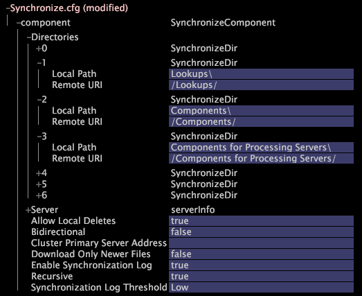

# 기존 클러스터에 Insight Server FSU 추가{#adding-an-insight-server-fsu-to-an-existing-cluster}

{{eol}}

추가 파일 서버에 소스 데이터를 저장하거나 마스터 Insight Server에 대한 백업을 설정하려면 기존 클러스터에 Insight Server FSU를 추가할 수 있습니다.

를 추가하려면 [!DNL Insight Server] 기존 클러스터에 FSU를 사용하려면 다음 절차를 수행해야 합니다.

1. [기본 서버에서 구성 파일 업데이트](../../../../../home/c-inst-svr/c-install-ins-svr/c-ins-svr-clstrs/c-add-ins-svrs-ex-clstr/c-add-fsu-ex-clstr.md#section-b5f21f2edb35493da4475de2cdeefca1)
1. [새 Insight Server FSU 설치](../../../../../home/c-inst-svr/c-install-ins-svr/c-ins-svr-clstrs/c-add-ins-svrs-ex-clstr/c-add-fsu-ex-clstr.md#section-dddad299dd8642aa91cbe19a395ef3f4)
1. [새 Insight Server FSU 구성](../../../../../home/c-inst-svr/c-install-ins-svr/c-ins-svr-clstrs/c-add-ins-svrs-ex-clstr/c-add-fsu-ex-clstr.md#section-c39334c5bd754d5b98d41ad094333108)

## 기본 서버에서 구성 파일 업데이트 {#section-b5f21f2edb35493da4475de2cdeefca1}

in [!DNL Insight]를 열고 [!DNL Server Files Manager] 마스터 [!DNL Insight Server] (일반적으로 [!DNL Insight Server] FSU) 및 클러스터에 추가할 각 FSU에 대해 다음을 수행합니다.

1. 마스터에서 주소 파일 편집 [!DNL Insight Server] 에 설명된 대로 새 FSU의 이름과 주소를 포함시키기 위해 [주소 파일에 처리 Insight Server 추가](../../../../../home/c-inst-svr/c-install-ins-svr/c-ins-svr-clstrs/c-inst-ins-svr-clstr/c-inst-proc-clstr/c-config-mstr-ins-svr-clstr.md#section-2fe5298180164e8dbaa59ea6b6ff682d). 클러스터의 현재 그룹에 새 FSU의 이름과 주소를 추가합니다 [!DNL Insight Servers] 나열됩니다.

1. 마스터에서 액세스 제어 파일 편집 [!DNL Insight Server] 에 설명된 대로 새 FSU의 IP 주소를 포함하려면 [클러스터의 액세스 제어 파일 업데이트](../../../../../home/c-inst-svr/c-install-ins-svr/c-ins-svr-clstrs/c-inst-ins-svr-clstr/c-inst-proc-clstr/c-config-mstr-ins-svr-clstr.md#section-fce1367d92a445168c35e9ca506e7d6b).

## 새 Insight Server FSU 설치 {#section-dddad299dd8642aa91cbe19a395ef3f4}

1. 현재 FSU에서 [!DNL Insight Server] 설치 디렉토리 및 새 FSU에 파일을 복사합니다.
1. 파일을 저장할 위치에 압축을 해제합니다 [!DNL Insight Server] 소프트웨어.
1. 에 설명된 대로 새 FSU용 디지털 인증서를 다운로드하여 설치합니다. [디지털 인증서 다운로드 및 설치](../../../../../home/c-inst-svr/c-install-ins-svr/t-install-proc-inst-svr-dpu/c-dnld-dgtl-cert/c-dnld-dgtl-cert.md#concept-4f79c240492f4e52b6375b4b3bbefa17).
1. 새 FSU에서 Windows 메모리 사용률 매개 변수를 설정합니다.
1. 이름 변경 [!DNL .address] 파일에 설명된 대로 FSU의 이름을 반영합니다. [서버의 네트워크 위치 정의](../../../../../home/c-inst-svr/c-install-ins-svr/t-install-proc-inst-svr-dpu/c-svrs-ntwk-loc/c-svrs-ntwk-loc.md#concept-87dd2aa3448c415ca1285bc445a8c649).

1. 새 FSU의 드라이브 구조가 기본 FSU의 드라이브 구조와 다른 경우 [!DNL Disk Files.cfg] 파일.

   1. 를 엽니다. [!DNL Disk Files.cfg] 새 FSU의 파일
   1. 에 설명된 대로 기본 FSU의 드라이브와 일치하도록 설정을 업데이트합니다. [데이터 집합 데이터 공간 모니터링](../../../../../home/c-inst-svr/c-admin-inst-svr/c-mntr-disk-spc/t-mntr-dtst-data-spc.md#task-6223fa2c718845678824a0a96df96a03).
   1. 로컬과 서버에 파일을 저장합니다.

1. 등록 [!DNL Insight Server] 에 설명된 대로 새 FSU 시스템에서 Windows 서비스로 사용할 수 있습니다. [Insight Server를 Windows 서비스로 등록](../../../../../home/c-inst-svr/c-install-ins-svr/t-install-proc-inst-svr-dpu/c-reg-wdws-svc.md#concept-f2c7aa891d544a2595aa01d0d796a540).

1. 클러스터에 추가할 각 추가 FSU에 대해 1~6단계를 반복합니다.

## 새 Insight Server FSU 구성 {#section-c39334c5bd754d5b98d41ad094333108}

다음 절차에서는 특정 구성 작업에 대한 지침을 제공합니다. 새 FSU의 구현에 적합한 지침을 따르십시오.

**소스 데이터 스토리지에 대한 FSU를 구성하려면**

새 FSU가 클러스터에서 실행 중인 데이터 집합에 대한 추가 소스 데이터를 저장하는 경우, 구성 의 설명에 따라 파일 서버 구성 프로세스를 완료해야 합니다 [!DNL Insight Server] File Server Unit in the Log Processing Configuration File 장에서 *데이터 집합 구성 안내서*.

**마스터의 백업을 새 FSU로 만들려면 [!DNL Insight Server] FSU**

새 FSU를 마스터의 백업으로 만들려면 [!DNL Insight Server] (클러스터의 FSU로 제공됨) 마스터 FSU와 동기화되도록 새(백업) FSU에서 동기화 파일을 수정해야 합니다.

1. 백업 시 [!DNL Insight Server] FSU, [!DNL Server Files Manager] 를 복사하려면 [!DNL Synchronize.cfg] 파일의 [!DNL Components for Processing Servers] 폴더 [!DNL Components] 폴더를 입력합니다.

1. 를 엽니다. [!DNL Synchronize.cfg] 파일( [!DNL Components] 폴더)의 [!DNL Insight].

1. Components 디렉토리의 위치를 지정하는 SynchronizeDir을 찾습니다. Directories 아래에 여러 개의 동기화 디렉터리가 나열될 수 있으므로, 원하는 서버를 찾기 위해 많은 수의 동기화 디렉터리(서버 번호를 클릭하여)를 확인해야 할 수 있습니다.
1. SynchronizeDir 항목을 편집하고 아래 예와 같이 두 번째 SynchronizeDir 항목을 추가합니다.

   

1. 수정된 파일을 다음과 같은 새 이름으로 저장합니다. [!DNL FSU_Synchronize.cfg] 그래서 네가 그것을 혼동하지 않도록 [!DNL Synchronize.cfg] 클러스터의 DPU에 있는 파일입니다.

1. 를 사용하십시오 [!DNL Server Files Manager] 이름이 변경된 파일의 로컬 복사본을 서버에 저장하려면 백업 FSU는 마스터에서 식별된 디렉토리의 파일을 다운로드합니다 [!DNL Insight Server] FSU 및 는 마스터에서 이러한 파일의 업데이트된 복사본을 동적으로 검색합니다 [!DNL Insight Server] FSU가 변경되면
