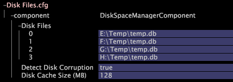

# 클러스터링을 위한 기본 Insight Server 구성{#configuring-the-master-insight-server-for-clustering}

Insight 기본 Server에서 클러스터 구성, 클러스터에 대한 액세스 제어 파일 업데이트 등에 대한 정보입니다.

클러스터를 구성하려면 마스터에서 다음 단계를 수행하십시오 [!DNL Insight Server].

* 처리 [!DNL Insight Servers’] 일반 이름과 주소를 주소 파일에 추가합니다.
* 파일의 클러스터 서버 그룹 [!DNL Insight Servers] 에 모든 파일을 [!DNL Access Control.cfg] 추가합니다.

* 마스터 [!DNL Synchronize.cfg] 를 가리키도록 처리 서버용 구성 요소 디렉토리에서 파일을 업데이트합니다 [!DNL Insight Server].

* 필요한 경우 처리 서버용 [!DNL Disk Files.cfg] 구성 요소 디렉토리에서 파일을 수정하여 처리 중인 [!DNL temp.db] 파일의 위치를 지정합니다 [!DNL Insight Servers].

이러한 단계를 완료하려면 클러스터의 각 IP 주소 및 일반 이름(개인 디지털 인증서 [!DNL Insight Server]에 지정됨) [!DNL Insight Server] 을 알아야 합니다. 이 정보가 아직 없는 경우 계속하기 전에 해당 정보를 얻으십시오.

>[!NOTE]
>
>이 섹션에 설명된 절차는 필수입니다 [!DNL Insight]. 설치하지 않은 경우 [!DNL Insight]계속하기 전에 사용자 안내서의 **[!DNL Insight]지침을** 따르십시오.

## 주소 파일에 처리 인사이트 서버 추가 {#section-2fe5298180164e8dbaa59ea6b6ff682d}

다음 절차를 사용하여 처리 [!DNL Insight Servers’] 공통 이름과 IP 주소를 마스터의 주소 파일에 추가합니다 [!DNL Insight Server]. 주소 파일은 마스터에서 유지 관리되고 관리되지만 클러스터 [!DNL Insight Server]의 모든 [!DNL Insight Servers] 에서 사용됩니다.

>[!NOTE]
>
>다음은 주소 파일이 이미 마스터용으로 구성되어 있다고 가정합니다 [!DNL Insight Server]. 마스터 [!DNL Insight Server’s] IP 주소를 주소 파일에 아직 추가하지 않은 경우 시작하기 전에 서버 네트워크 위치 [정의에 설명된 절차를](../../../../../../home/c-inst-svr/c-install-ins-svr/t-install-proc-inst-svr-dpu/c-svrs-ntwk-loc/c-svrs-ntwk-loc.md#concept-87dd2aa3448c415ca1285bc445a8c649) 완료하십시오.

**주소 파일[!DNL Insight Servers]에 처리를 추가하려면**

1. 제목 표시줄 [!DNL Insight] 을 마우스 오른쪽 단추로 클릭하고 **[!UICONTROL Switch Profile]** **[!UICONTROL Configuration]**> 을 클릭하여 구성 프로필을 시작 및 로드합니다(아직 열려 있지 않은 경우).

1. 서버 관리자 작업 영역 [!DNL Insight]을 열려면 [!DNL Admin] > [!DNL Dataset and Profile] 탭에서 **[!UICONTROL Servers Manager]** 축소판을 클릭합니다.

1. 마스터의 아이콘을 마우스 오른쪽 단추로 **[!UICONTROL Insight Server]** 클릭하고 을 클릭합니다 **[!UICONTROL Server Files]**.

1. 에서 주소 [!DNL Server Files Manager]디렉토리를 열고 다음을 수행하여 [!DNL Insight Server’s] 주소 파일을 엽니다.

   1. 서버 이름 *열에서 확인 표시를 마우스 오른쪽 단추로 클릭하고 을 클릭합니다* **[!UICONTROL Make Local]**.

   1. 열에서 확인 표시를 마우스 오른쪽 단추로 클릭하고 [!DNL Temp] > **[!UICONTROL Open]** **[!UICONTROL in Insight]**&#x200B;을 클릭합니다.

1. 구조 내용을 [!DNL Locations] 확장한 다음 NetworkLocation 0, Address 및 AddressDefinition을 확장합니다.
1. 클러스터의 각 처리에 대해 NetworkLocation 0에 AddressDefinition을 추가하려면 다음을 수행합니다. [!DNL Insight Server]

   1. 마우스 오른쪽 단추 **[!UICONTROL AddressDefinition]** 를 클릭하고 **[!UICONTROL Add New]** > 을 **[!UICONTROL Address Definition]**&#x200B;클릭합니다.

   1. 이름 매개 변수에서 처리 [!DNL Insight Server’s] 공통 이름을 지정합니다.
   1. 주소 매개 변수에서 처리 [!DNL Insight Server’s] IP 주소를 지정합니다.

      10.10.116과 같이 주소 필드에 와일드카드로 별표(*)를 사용할 수 있습니다.* 클러스터링을 간소화할 수 있습니다. See [Understanding Access Levels](../../../../../../home/c-inst-svr/c-admin-inst-svr/c-config-acs-ctrl/c-undst-acc-lvls.md#concept-6b292edf79214750a8d0525097b8795a).

      다음 예제는 두 개의 클러스터를 정의합니다 [!DNL Insight Servers].

      

1. 서버가 여러 네트워크에 연결된 경우 6단계를 반복하여 해당 네트워크의 NetworkLocations [!DNL Insight Servers] 에 처리를 추가합니다.

   다음 예에서는 두 네트워크에 연결된 4개의 클러스터(&quot;기업 인트라넷&quot; 및 &quot;인터넷&quot;)를 보여 줍니다. [!DNL Insight Servers]

   

1. 다음을 수행하여 서버에 변경 내용을 저장합니다.

   1. 창 위쪽 **[!UICONTROL (modified)]** 을 마우스 오른쪽 단추로 클릭하고 을 클릭합니다 **[!UICONTROL Save]**.

   1. 에서 열 [!DNL Server Files Manager]에 있는 파일의 확인 표시를 마우스 오른쪽 단추로 클릭하고 > [!DNL Temp] &lt; **[!UICONTROL Save to]** > *을 선택합니다&#x200B;**[!UICONTROL server name]***.

## 클러스터의 액세스 제어 파일 업데이트 {#section-fce1367d92a445168c35e9ca506e7d6b}

클러스터 [!DNL Insight Servers] 에서 사용하려면 클러스터 [!DNL Insight Server] (마스터 포함)의 각 [!DNL Insight Server]이 클러스터 서버 액세스 제어 그룹에 속해 있어야 합니다. 클러스터 서버 그룹은 클러스터에 참여할 수 있는 서버(IP 주소)를 식별합니다. 이 파일은 마스터에서 유지 관리되고 관리되지만 클러스터 [!DNL Insight Server]의 모든 [!DNL Insight Servers] 에서 사용됩니다.

**액세스 제어 파일을 편집하려면**

1. 서버 관리자 작업 영역 [!DNL Insight]을 열려면 [!DNL Admin] > [!DNL Dataset and Profile] 탭에서 **[!UICONTROL Servers Manager]** 축소판을 클릭합니다.

1. 마스터의 아이콘을 마우스 오른쪽 단추로 [!DNL Insight Server] 클릭하고 을 클릭합니다 **[!UICONTROL Server Files]**.

1. 액세스 제어 디렉터리 [!DNL Server Files Manager]를 엽니다.
1. 다음을 수행하여 [!DNL Access Control.cfg] 파일을 엽니다.

   1. 서버 이름 *열에서 확인 표시를 마우스 오른쪽 단추로 클릭하고 을 클릭합니다* **[!UICONTROL Make Local]**.

   1. 열에서 확인 표시를 마우스 오른쪽 단추로 클릭하고 [!DNL Temp] > **[!UICONTROL Open]** **[!UICONTROL in Insight]**&#x200B;을 클릭합니다.

1. 액세스 제어 그룹 구조를 확장한 다음 AccessGroup(클러스터 서버)을 확장합니다.
1. 클러스터 [!DNL Insight Server] 의 각(마스터 포함)에 대해 다음을 [!DNL Insight Server]수행합니다.

   1. 마우스 오른쪽 단추 **[!UICONTROL Members]** 를 클릭하고 **[!UICONTROL Add New]** > 을 **[!UICONTROL New Member]**&#x200B;클릭합니다.

   1. IP 주소(이름이 아니라 숫자 IP 주소)를 지정합니다. [!DNL Insight Server’s] 서버가 여러 네트워크에 [!DNL Insight Servers] 연결되어 있는 경우 이 AccessGroup은 클러스터 내 서버 간 통신에 [!DNL Insight Servers] 사용하는 내부 주소만 포함해야 합니다.

      다음은 네 개의 클러스터에 대한 AccessGroup(클러스터 서버)을 보여주는 [!DNL Insight Servers]것입니다.

      

1. 다음을 수행하여 서버에 변경 내용을 저장합니다.

   1. 창 위쪽 **[!UICONTROL (modified)]** 을 마우스 오른쪽 단추로 클릭하고 을 클릭합니다 **[!UICONTROL Save]**.

   1. 에서 열 [!DNL Server Files Manager]에 있는 파일의 확인 표시를 마우스 오른쪽 단추로 클릭하고 > [!DNL Temp] > **[!UICONTROL Save to]** &lt; *>**[!UICONTROL server name]***&#x200B;을 클릭합니다.

## 동기화 파일 구성 {#section-d23e751771c84da6bab6a34a8db867bc}

다음 절차를 사용하여 파일의 중앙 복사본을 구성할 수 [!DNL Synchronize.cfg] 있습니다. 이 파일의 중앙 사본은 마스터에서 유지됩니다 [!DNL Insight Server]. 클러스터 [!DNL Insight Servers] 의 처리에서는 마스터와 통신을 시작하여 이 파일의 업데이트된 복사본을 [!DNL Insight Server] 검색합니다.

이 [!DNL Synchronize.cfg] 파일은 마스터의 위치를 지정합니다 [!DNL Insight Server]. 또한 클러스터의 각 처리가 마스터에서 검색하는 관리 파일 세트 [!DNL Insight Servers] 를 식별합니다 [!DNL Insight Server]. 작업이 시작되면 이 파일들이 마스터에서 자동으로 [!DNL Insight Servers] [!DNL Insight Server] 다운로드됩니다. 또한 파일이 변경될 [!DNL Insight Server] 때 마스터에서 이러한 파일의 업데이트된 복사본을 동적으로 검색합니다.

>[!NOTE]
>
>마스터에서 [!DNL Synchronize.cfg] 파일을 구성하지만 마스터 [!DNL Insight Server]자체에서는 이 파일을 [!DNL Insight Server] 사용하지 않습니다. 이 파일은 처리가 파일을 검색할 때 제대로 구성되도록 마스터에서 [!DNL Insight Server] [!DNL Insight Servers] 업데이트합니다.

**마스터에서 Synchronize.cfg 파일을 업데이트하려면[!DNL Insight Server]**

1. 서버 관리자 작업 영역 [!DNL Insight]을 열려면 [!DNL Admin] > [!DNL Dataset and Profile] 탭에서 **[!UICONTROL Servers Manager]** 축소판을 클릭합니다.

1. 마스터의 아이콘을 마우스 오른쪽 단추로 [!DNL Insight Server] 클릭하고 을 클릭합니다 **[!UICONTROL Server Files]**.

1. 에서 [!DNL Server Files Manager]Processing Server **[!UICONTROL Components]** 디렉토리를 엽니다.

1. 열려면 다음을 수행합니다 [!DNL Synchronize.cfg].

   1. 서버 이름 *열에서 확인 표시를 마우스 오른쪽 단추로 클릭하고 을 클릭합니다* **[!UICONTROL Make Local]**.

   1. 확인 표시를 마우스 오른쪽 단추로 클릭하고 [!DNL Temp] > 를 **[!UICONTROL Open]** **[!UICONTROL in Insight]**&#x200B;클릭합니다.

1. 구성 요소 구조를 확장합니다.
1. 클러스터 기본 서버 주소 매개 변수에서 마스터(기본)의 IP 주소를 지정합니다 **[!UICONTROL Insight Server]**.

   

   마스터와 처리 간에 동기화가 발생할 때마다 기록하는 로그 [!DNL Insight Server] 를 만들려면 [동기화 로그 활성화] 매개 변수 [!DNL Insight Servers]가 &quot;true&quot;로 설정되어 있는지 확인하십시오.

1. 다음을 수행하여 서버에 변경 내용을 저장합니다.

   1. 창 위쪽 **[!UICONTROL (modified)]** 을 마우스 오른쪽 단추로 클릭하고 을 클릭합니다 **[!UICONTROL Save]**.

   1. 에서 열 [!DNL Server Files Manager]에 있는 파일의 확인 표시를 마우스 오른쪽 [!DNL Temp] 단추로 클릭하고 **[!UICONTROL Save to]** > *&lt;**[!UICONTROL server name]**>*&#x200B;를 클릭합니다.

## 데이터 집합 위치 구성(temp.db) {#section-5ec257a4b4c64fb58baec1f12119a822}

처리가 기본 위치와 다른 디렉터리 또는 드라이브 [!DNL Insight Servers] 에서 데이터 세트 [!DNL temp.db] 를 유지하거나 여러 드라이브에 배포하려는 경우 다음 절차를 [!DNL temp.db] 수행합니다.

>[!NOTE]
>
>처리 [!DNL Insight Servers] [!DNL Disk Files.cfg]모두 동일하게 공유되므로 이 파일에서 지정한 파일 위치를 모두 지원해야 합니다. 예를 들어 E에 지정하는 경우: [!DNL temp.db] 드라이브, 클러스터 [!DNL Insight Server] 의 모든 처리에는 E가 있어야 합니다.드라이브.

**temp.db의 위치를 구성하려면**

1. 서버 관리자 작업 영역 [!DNL Insight]을 열려면 [!DNL Admin] > [!DNL Dataset and Profile] 탭에서 **[!UICONTROL Servers Manager]** 축소판을 클릭합니다.

1. 마스터의 아이콘을 마우스 오른쪽 단추로 [!DNL Insight Server] 클릭하고 을 클릭합니다 **[!UICONTROL Server Files]**.

1. 에서 [!DNL Server Files Manager]디렉토리를 **[!UICONTROL Components for Processing Servers]** 엽니다.

1. 열려면 다음을 수행합니다 [!DNL Disk Files.cfg].

   1. 서버 이름 *열에서 확인 표시를 마우스 오른쪽 단추로 클릭하고 을 클릭합니다* **[!UICONTROL Make Local]**.

   1. 열에서 확인 표시를 마우스 오른쪽 단추로 [!DNL Temp]클릭하고 **[!UICONTROL Open]** > **[!UICONTROL in Insight]**&#x200B;을 클릭합니다.

1. DiskSpaceManagerComponent 구조를 확장한 다음 디스크 파일 목록을 확장합니다.
1. 항목 0을 편집하여 [!DNL temp.db] 파일의 위치를 변경합니다.
1. 여러 드라이브에 배포하려면 아래 단계를 사용하여 각 추가 드라이브에 대한 추가 항목을 만듭니다. [!DNL temp.db]

   1. 마우스 오른쪽 단추 **[!UICONTROL Disk Files]** 를 클릭하고 **[!UICONTROL Add New]** > 을 **[!UICONTROL Disk File]**&#x200B;클릭합니다.

   1. 새 항목에서 쓸 위치를 [!DNL temp.db] 지정합니다.
   다음은 4개의 드라이브에 [!DNL temp.db] 기록된 내용입니다.

   

1. 다음을 수행하여 서버에 변경 내용을 저장합니다.

   1. 창 위쪽 **[!UICONTROL (modified)]** 을 마우스 오른쪽 단추로 클릭하고 을 클릭합니다 **[!UICONTROL Save]**.

   1. 에서 열 [!DNL Server Files Manager]에 있는 파일의 확인 표시를 마우스 오른쪽 [!DNL Temp] 단추로 클릭하고 **[!UICONTROL Save to]** > *&lt;**[!UICONTROL server name]**>*&#x200B;를 클릭합니다.

