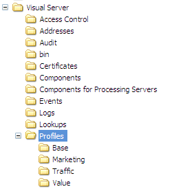

# 프로필 및 조회 파일 설치{#installing-profiles-and-lookup-files}

Adobe이 특정 애플리케이션용으로 개발한 프로필 및 조회 파일은 데이터 집합을 분석할 수 있도록 해주는 지표, 차원 및 작업 공간을 제공하는 내부 프로필입니다.

Adobe이 제공하는 다른 모든 내부 프로필과 마찬가지로 이러한 프로필은 변경하지 않아야 합니다. 모든 사용자 지정은 데이터 세트 또는 역할별 프로필 또는 사용자가 만드는 기타 프로필에서 수행해야 합니다.

Adobe은 응용 프로그램의 프로필 및 조회 파일을 [!DNL .zip] 파일로 배포합니다. 각 zip 파일의 이름은 해당 파일에 포함된 프로필 및 조회 파일이 있는 애플리케이션의 이름입니다. (예를 들어 [!DNL Site52.zip] 에는 Site v5.2의 프로필 파일이 포함되어 있습니다.) [!DNL .zip] 파일에는 두 개의 폴더( [!DNL Lookups] 와 [!DNL Profiles])가 있습니다.

>[!NOTE]
>
>애플리케이션에 대한 프로필 및 조회 파일이 포함된 설치 파일이 아직 없는 경우 시작하기 전에 Adobe FTP 사이트에서 다운로드하십시오.

데이터 집합 프로필을 처리하고 실행하는 [!DNL Insight Server] 컴퓨터에 프로필 및 해당 조회 파일을 설치해야 합니다. [!DNL Insight Server] 클러스터를 실행 중인 경우 마스터 서버에 파일을 설치해야 합니다. 데이터 집합 프로필에 대한 자세한 내용은 *데이터 집합 구성 안내서*&#x200B;를 참조하십시오.

**Adobe 애플리케이션용 프로필을 설치하려면**

1. Adobe이 제공한 [!DNL .zip] 파일에서 [!DNL Profiles] 폴더를 엽니다.

1. [!DNL .zip] 파일의 [!DNL Profiles] 폴더 내의 모든 폴더를 [!DNL Insight Server] 설치 디렉토리의 [!DNL Profiles] 폴더에 복사합니다. 다음 예와 같이 [!DNL Insight Server]에&#x200B; [!DNL ...\Profiles\]*&lt; [!DNL internal profile name]* 폴더가 표시됩니다. 실제 프로필 이름이 다를 수 있습니다.

   

1. [!DNL Insight Server] 를 설치한 디렉토리의&#x200B; [!DNL Profiles\]*&lt; [!DNL dataset profile name]* 폴더로 이동하여 이 디렉토리에서 [!DNL profile.cfg] 파일을 찾습니다.

   >[!NOTE]
   >
   >처음으로 프로필을 설치하는 경우 제공된 샘플 프로필을 데이터 세트 프로필로 사용할 수 있습니다. [!DNL Insight Server] 설치 디렉토리의 [!DNL Profiles\Sample] 폴더 내에서 Sample 프로필의 [!DNL profile.cfg] 파일([!DNL profile.cfg.offline])을 찾을 수 있습니다.

1. 메모장과 같은 텍스트 편집기를 사용하여 [!DNL profile.cfg] 파일을 열고 다음을 수행합니다.

   1. 디렉토리 벡터에 내부 프로필에 대한 항목을 추가합니다. 프로필 이름은 [!DNL Insight Server] 컴퓨터의 [!DNL Profiles] 폴더에 복사한 디렉토리의 이름에 해당합니다.

   1. 디렉토리 수를 적절하게 업데이트합니다.
   1. 아래 강조 표시된 대로 이 파일의 일반 이름 행에 서버의 일반 이름을 추가합니다.

      ```
      Profile = profileInfo: 
      Directories = vector: n+1 items
        0 = string: Base\\
        1 = string: internal profile name 1\\
        2 = string: internal profile name 2\\
      . . .
        n = string: internal profile name n\\
      Processing Servers = vector: 1 items
        0 = ProfileServerInfo: 
          Common Name = string: serverCommonName
          Server = string: 
      ```

      >[!NOTE]
      >
      >[!DNL profile.cfg] 파일에서 공통 이름에 대해 지정하는 *serverCommonName*&#x200B;은(는) 데이터 집합 프로필을 처리하고 실행하는 [!DNL Insight Server] 컴퓨터의 서버 공통 이름에 해당합니다. 데이터 세트 프로필이 [!DNL Insight Server] 클러스터에서 실행되도록 [!DNL profile.cfg]을 업데이트하는 방법에 대한 지침은 [Insight Server 클러스터](../../../../home/c-inst-svr/c-install-ins-svr/c-ins-svr-clstrs/c-abt-ins-svr-clsters.md)를 참조하십시오.

1. 파일을 저장합니다. 이름이 다르게 지정된 경우 파일을 [!DNL profile.cfg](으)로 저장해야 합니다.

**Adobe 응용 프로그램에 대한 조회 파일을 설치하려면**

1. Adobe이 제공한 [!DNL .zip] 파일에서 [!DNL Lookups] 폴더를 엽니다.

1. [!DNL .zip] 파일의 [!DNL Lookups] 폴더 내의 모든 폴더를 [!DNL Insight Server] 설치 디렉토리의 [!DNL Lookups] 폴더에 복사합니다. 다음 예와 같이 [!DNL Insight Server]에&#x200B; [!DNL ...\Lookups\]*&lt; [!DNL internal profile name]* 폴더가 표시됩니다. 실제 프로필 이름이 다를 수 있습니다.

   
