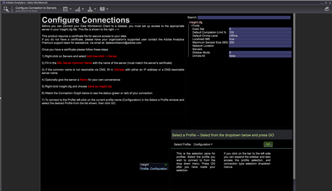

# 워크스테이션 설정 마법사{#workstation-setup-wizard}

데이터 워크벤치에서는 워크스테이션(클라이언트) 애플리케이션을 설치하기 위한 설정 마법사를 제공합니다.

## 설치 마법사를 사용하여 워크스테이션 설치 {#section-58da9bb6196c46eab3b54146913fdcb8}

설치 마법사 실행 파일을 실행하고 각 단계를 수행하여 워크스테이션 클라이언트 프로그램을 설치합니다. 워크스테이션 설치 후 서버 및 프로필에 연결할 수 있습니다.

1. 워크스테이션 설치 프로그램 실행 파일을 두 번 클릭합니다.
1. Windows **에** 프로그램을 설치하려면 예를 클릭합니다.
1. 설치 **마법사의** 언어를 선택합니다.

   마법사가 열립니다.

   

1. 데이터 **워크벤치** 설정 마법사 **시작 대화 상자에서 다음을** 클릭합니다.

1. 새 설치를 **설치하거나** 기존 **설치를 업그레이드 또는 복구하려면** 선택합니다.

   **새 설치는** 이전에 설치된 파일을 덮어씁니다.

   **워크스테이션을 최신 버전으로 업그레이드하거나** 기존 설치를 복구할 수 있습니다. Data Workbench는 설치된 **Insight.exe** 파일을 비교하고 최신 버전의 클라이언트를 사용할 수 있는 경우 워크스테이션 설정 마법사를 실행합니다.

1. 설치 위치 선택:

   **기본 폴더 및 위치에 일반적인** 설치

   * 프로그램 파일은 기본적으로 다음과 같이 저장됩니다.

      ```
      C:\Program Files\Adobe\Adobe Analytics\Data Workbench
      ```

   * 데이터 파일(프로필, 인증서, 추적 로그 및 사용자 파일)은 기본적으로 다음과 같이 저장됩니다.

      ```
      C:\Users\<username>\AppData\Local\Adobe\Adobe Analytics\Data Workbench\
      ```

      >[!IMPORTANT]
      >
      >서버 세부 ***정보가*** 없는 일반 Insight.cfg 파일이 처음 설치됩니다. 이전 설치에서 파일을 이동하지 않고 새로 설치된 ***Insight.cfg*** 파일을 사용하여 사용자 지정하는 것이 좋습니다. 워크스테이션 설치 경로가 변경되었으므로 글꼴 추가, 사용자 폴더 제거 *및**TraceFileComponent*의 제거를 권장합니다.

1. (선택 사항) **** 언어 패키지 및 프로그램 및 데이터 파일의 위치를 선택하려면 [사용자 정의]를 선택합니다.
1. [시작] 메뉴에서 **단축키의 위치를 선택합니다**.

   

   시작 **메뉴 폴더** 만들기를 클릭하여 Windows 시작 메뉴에 바로 가기를 설치하지 않습니다.

1. **다음을 클릭합니다.** 선택한 파일 위치 경로 및 언어에 대한 요약이 표시됩니다. Click **Install.**

1. 데이터 워크벤치 **인증서를 찾습니다**.

   설치 마법사에서 설치 중에 데이터 워크벤치 인증서를 찾을 수 없는 경우 대화 상자를 열어 인증서 위치(클라이언트 인증서 폴더에 기본적으로 있는 **.pem** 파일) **를** 찾아보거나, 건너뛰기 를 **클릭하여** 설치 후인증서를찾습니다.

   인증서를 **찾은** 후 설치를 클릭합니다.

1. 설치 마법사가 완료되고 데이터 워크벤치가 설치된 후 완료를 **클릭하여** 설치를 완료합니다.

   >[!NOTE]
   >
   >워크스테이션 설정 마법사의 기본 로그 위치( **[!DNL C:\Users\&#39;)<userName>&#39;\AppData\Local\Temp.]**

   설정 **후 워크벤치를 열려면 애플리케이션** 시작 확인란을 선택합니다.

1. **파일의 서버에 대한 연결을** 구성합니다 **[!DNL Insight.cfg]** .

   워크스테이션 설치 후 Insight.cfg [파일에서 서버 연결 정보를](/help/home/c-get-started/c-insght-config-param.md) *입력하는 방법과 드롭다운에서 프로파일을 선택하는 옵션을 사용하여 향상된 워크스테이션 구성* 환경작업 영역이 열립니다. 서버에 대한 연결 상태를 볼 수도 있습니다.

   

## 설치 폴더 {#section-b5ea5a3b3ecb4622aef713972f3f8ebd}

데이터 워크벤치 폴더 구조에는 두 개의 설치 위치가 있습니다.

* **프로그램** 파일 **Insight.exe** 및 지원 클라이언트 파일(**Insight.ini**)은

   ```
   C:\Program Files\Adobe\Analytics\DataWorkbench
   ```

* Appdata **폴더** .

   **Insight.cfg**, 프로필, 인증서, 추적 로그 및 사용자 파일은 이제

   ```
   C:\Users\<Winuser>\AppData\Adobe\Analytics\DataWorkbench\ 
   ```

   다음 **파일에서 Appdata** `Insight.ini` 폴더의 경로를 설정할 수 있습니다.

   ```
   [InitialSettings] 
   AppDataFolder=C:\Users\mhiatt\AppData\Local\Adobe\Adobe Analytics\Data Workbench\ 
   Locale=en-us
   ```

## 워크스테이션 제거 {#section-5ce2e233fe4348469ef1b3c451dd5b70}

이제 데이터 워크벤치에 워크스테이션 제거 실행 파일이 포함되어 있습니다(기본적으로 위치). **`Program Files\Adobe\Adobe Analytics\Data Workbench\ unins000.exe`**

실행 후 단계에 따라 하드 드라이브에서 Data Workbench Workstation 파일을 제거합니다.

>[!NOTE]
>
>시작 메뉴 또는 **>** 에서 데이터 워크벤치 제거 **단축키를 사용하여 폴더에서 unins000.exe** 실행 파일을 실행할 수 **[!UICONTROL Control Panel]** 있습니다 **[!UICONTROL Program and Features]**.
