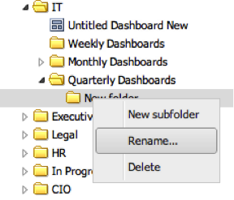

# 폴더 이름 바꾸기{#renaming-folders}

1. 이름을 변경할 폴더를 마우스 오른쪽 단추로 클릭하고 **[!UICONTROL Rename…]** 을 선택합니다.

   

1. 폴더의 새 이름을 입력하고 **[!UICONTROL Enter]** 키를 누릅니다.

   

   작업이 성공하면 폴더 이름이 변경되었음을 알리는 메시지가 표시됩니다.
