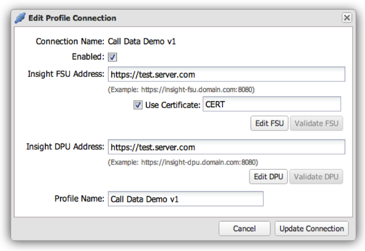

# 프로필 연결 편집{#editing-a-profile-connection}

1. 편집할 프로필 연결의 행  끝에 있는 톱니바퀴 아이콘을 클릭합니다.

   

1. 프로필 연결 설정을 편집하고 클릭하여 **[!UICONTROL Update Connection]** 저장합니다.

   작업이 성공하면 프로필 연결이 성공적으로 업데이트되었음을 나타내는 메시지가 표시됩니다.