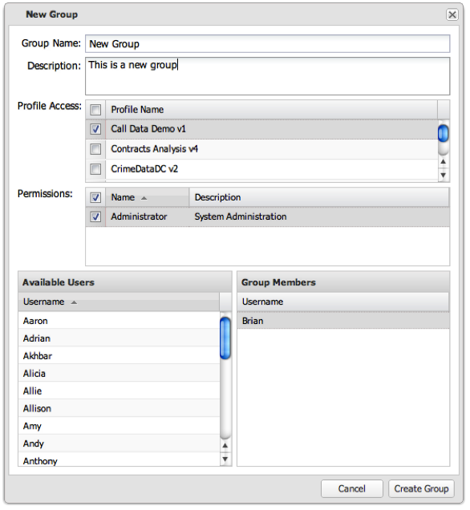

# 사용자 그룹 생성{#creating-a-user-group}

1. **[!UICONTROL Create Group]**&#x200B;을 클릭하여 **[!UICONTROL New Group]** 양식을 표시합니다.

   

1. 필요한 필드를 입력하여 양식을 완료합니다.

   <table id="choicetable_3AE53AAC8A07471394EA993917B6AE33"> 
    <thead class="chhead sthead"> 
    <th class="choptionhd"> 옵션</th> 
    <th class="chdeschd"> 설명</th> 
    </thead> 
    <tr class="chrow strow"> 
    <td class="choption"><strong>그룹 이름</strong></td> 
    <td class="chdesc stentry"> 고유한 그룹 이름을 입력합니다.</td> 
    </tr> 
    <tr class="chrow strow"> 
    <td class="choption"><strong>설명</strong></td> 
    <td class="chdesc stentry"> 그룹에 대한 간단한 설명을 입력합니다(선택 사항).</td> 
    </tr> 
    <tr class="chrow strow"> 
    <td class="choption"><strong>프로필 액세스</strong></td> 
    <td class="chdesc stentry"> 이 그룹에 액세스할 프로필을 선택합니다.</td> 
    </tr> 
    <tr class="chrow strow"> 
    <td class="choption"><strong>권한</strong></td> 
    <td class="chdesc stentry"> 
  관리자:모든 프로파일에 대한 모든 대시보드를 저장, 보기, 수정 및 삭제합니다. 관리자 권한을 사용하여 사용자가 관리 영역에 로그인하고 모든 관리 기능을 수행할 수 있습니다. 
 
  읽기 전용:대시보드에 대한 읽기 전용으로 권한을 제한합니다. 사용자는 시각화를 추가 또는 수정하거나 대시보드를 저장할 수 없습니다. 
 
 <b>선택한 권한 없음  </b>(기본값):권한을 검사하지 않으면 일반 사용자에게 그룹에 대한 권한을 부여합니다. 이러한 사용자는 시각화를 생성 및 수정하고 대시보드를 저장하고 액세스 권한이 있는 대시보드를 볼 수 있습니다. 
 </td> 
    </tr> 
    <tr class="chrow strow"> 
    <td class="choption"><strong>사용 가능한 사용자/그룹 구성원</strong></td> 
    <td class="chdesc stentry"> 사용 가능한 사용자 목록의 사용자를  그룹 구성원  섹션으로 드래그하여 놓습니다. 그룹 구성원은 언제든지 수정할 수 있습니다. </td> 
    </tr> 
    </table>

1. **[!UICONTROL Create Group]**&#x200B;을 클릭하여 사용자 그룹을 만듭니다.

   작업이 성공하면 사용자 그룹이 성공적으로 생성되었음을 알리는 메시지가 표시됩니다.
