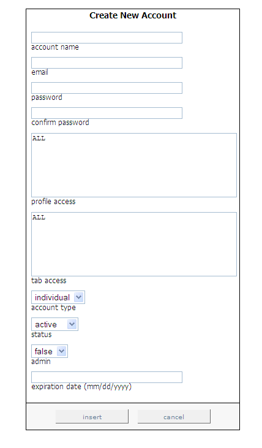

# 새 계정 추가{#adding-new-accounts}

새 계정을 추가하는 절차.

1. 탭에서 [!DNL Report Portal]탭을 클릭합니다 **[!UICONTROL Admin]** . 페이지가 [!DNL Admin] 나타납니다.

   

1. 페이지 오른쪽에서 을 클릭합니다 **[!UICONTROL new account]**. 페이지가 [!DNL Create New Account] 나타납니다.

   

1. 다음 표에 표시된 대로 이 페이지의 모든 필드를 완료합니다.

   | 이 필드에서... | 분류에 사용할 . . . |
   |---|---|
   | 계정 이름 | 로그인할 때 사용자가 제공해야 하는 계정의 [!DNL Report Portal]이름입니다. |
   | 이메일 | 사용자 또는 그룹의 이메일 주소입니다. |
   | password | 로그인할 때 사용자가 제공해야 하는 [!DNL Report Portal]암호입니다. |
   | 암호 확인 | 로그인할 때 사용자가 제공해야 하는 [!DNL Report Portal]암호입니다. |
   | 프로파일 액세스 | 이 사용자가 액세스할 수 있는 프로필(예: ProductSales) 여러 프로파일에 액세스하려면 이름을 쉼표로 구분합니다. 사용자가 연결된 모든 프로필에 액세스할 수 있는 경우 &quot;ALL&quot;을 [!DNL Report Portal]입력합니다. |
   | 탭 액세스 | 이 사용자가 액세스할 수 있는 탭(예: [!DNL Admin]). 여러 탭에 대한 액세스를 허용하려면 쉼표로 이름을 구분합니다. 사용자가 의 모든 탭에 액세스할 수 있는 경우 &quot;ALL&quot;을 [!DNL Report Portal]입력합니다. 이 필드는 계정 유형 필드와 함께 그룹 액세스 권한을 정의하는 데 매우 유용합니다. |
   | 계정 유형 | 이 계정이 개인 계정인지 그룹용인지 여부입니다. 개별 계정을 사용하면 사용자가 암호를 재설정할 수 있지만 그룹은 재설정할 수 없습니다. 관리자는 그룹 계정의 암호를 재설정할 수 있는 유일한 사람입니다. |
   | status | 이 계정이 활성 상태인지 비활성 상태인지 여부입니다. 기본값은 활성 상태입니다. 사용자 계정을 비활성화하려면 비활성을 선택합니다. |
   | 관리 | 이 사용자가 각 보고서와 관련된 메모를 편집할 수 있을 뿐만 아니라 사용자 계정을 생성, 업데이트 및 삭제할 수 있도록 허용할지 여부. 기본 설정은 false입니다. 이 사용자를 관리자 사용자로 만들려면 true를 선택합니다. |
   | 만료 날짜 | 이 사용자가 사용할 수 있을 때까지 MM/DD/YYYY 형식의 날짜입니다 [!DNL Report Portal]. |

1. 클릭 **[!UICONTROL insert]**.
