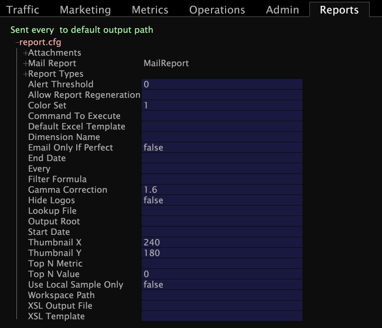

# 보고서 세트 구성{#configure-the-report-set}

{{eol}}

보고서 세트 폴더 내에서 작업 공간을 만들고 저장한 후에는 새 Report.cfg 파일을 만들어야 합니다.

에 를 지정해야 합니다. [!DNL Report.cfg] 보고서 세트, 보고서 생성 및 배포 시기 및 방법에 대한 파일입니다.

**새 Report.cfg를 만들려면**

1. Data Workbench에서 [!DNL Profile Manager] 작업 공간 내에서 마우스 오른쪽 단추 클릭 및 **[!UICONTROL Admin]** > **[!UICONTROL Profile]** > **[!UICONTROL Profile Manager]**.
1. 클릭 **[!UICONTROL Reports]** 열다 [!DNL Reports] 폴더를 입력합니다.
1. 보고서 세트의 폴더를 클릭합니다.
1. 에서 [!DNL User] 보고서 세트 폴더의 열에서 마우스 오른쪽 단추를 클릭하고 를 선택합니다. **[!UICONTROL Create]** > **[!UICONTROL Report]**. 새로운 [!DNL Report.cfg] 파일이 [!DNL File]열.
1. 에서 [!DNL User] 새 항목 열 [!DNL Report.cfg] 파일에서 [!DNL Report.cfg] 파일을 만든 다음 **[!UICONTROL Open]** > **[!UICONTROL from the workbench]**.

   

1. 원하는 대로 구성 매개 변수를 편집합니다. 이러한 매개 변수에 대한 자세한 내용은 [Report.cfg 매개 변수](../../../../../home/c-rpt-oview/c-rpt-param-ref/c-rpt-param.md#concept-838e59d72d3f4cb29ee15f5c7eb0ceff).

   >[!NOTE]
   >
   >샘플 [!DNL Report.cfg] 이 예제에 표시된 에는 [!DNL Report.cfg] 기본적으로 파일입니다. 매개 변수를 [!DNL Report.cfg] 파일, 텍스트 편집기를 사용해야 합니다. 단계에 대해서는 다음을 참조하십시오 [기존 Report.cfg 파일 편집](../../../../../home/c-rpt-oview/c-work-rpt-sets/c-edit-ex-rpt-files/c-edit-ex-rpt-files.md#concept-96fd57159f454defa09bd18655a12887).

1. 마우스 오른쪽 단추를 클릭하여 파일을 저장합니다 **[!UICONTROL Report.cfg (modified)]** 파일의 맨 위에서 **[!UICONTROL Save as Reports\]***&lt; **[!UICONTROL ReportSetName]**>***[!UICONTROL \Report.cfg]**.
1. 파일을 닫습니다.
1. 에서 [!DNL Profile Manager]에서 확인 표시를 마우스 오른쪽 단추로 클릭합니다. [!DNL User] 새 항목 열 [!DNL Report.cfg] 파일을 선택하고 **[!UICONTROL Save to]***&lt; **[!UICONTROL profile name]**>*.
