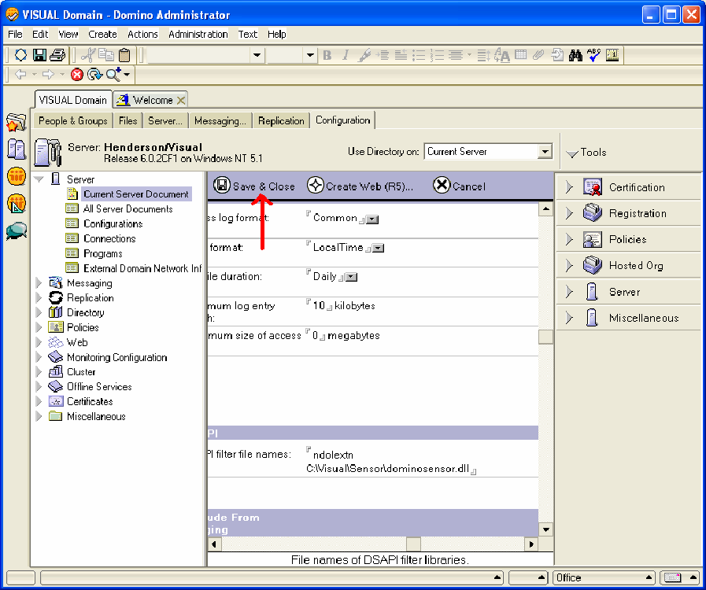

# Windows Server 2000 이상 버전의 Lotus Domino Server{#lotus-domino-server-on-windows-server-or-later}

Microsoft Windows Server 2000 이상에서 실행 중인 Windows 3.1 이상용 Lotus Domino Server 6용 센서의 설치 및 구성 방법에 대한 지침

센서용 프로그램 파일은 Adobe 다운로드 사이트에서 다운로드한 설치 파일로 패키지되어 있습니다. 특정 웹 서버에 대한 Sensor 설치 파일이 없는 경우 다음 절차를 시작하기 전에 해당 파일을 다운로드(또는 Adobe 담당자에게 제공)하십시오.

센서를 설치하고 구성하려면 다음 단계를 수행해야 합니다.

## 프로그램 파일 설치 {#section-2f3e85083b4f4aa989a85997330e86ae}

1. Lotus Domino 컴퓨터에서 Sensor 프로그램 파일을 설치할 디렉터리를 만듭니다. 디스크 대기열이 이 디렉토리에도 상주하므로 선택한 장치에 필요한 크기의 큐를 저장할 충분한 공간이 있는지 확인하십시오.

   ```
   C:\VisualSensor
   ```

1. 설치 파일의 내용을 Lotus Domino 디렉토리에 추출합니다. 이 단계 동안 Sensor는 다음 파일을 설치합니다.

<table id="table_ABFF5F92271B4F3CB0AC68DAB6A5709F"> 
 <thead> 
  <tr> 
   <th colname="col1" class="entry"> 파일 </th> 
   <th colname="col2" class="entry"> 설명 </th> 
  </tr> 
 </thead>
 <tbody> 
  <tr> 
   <td colname="col1"> EventMessages.dll </td> 
   <td colname="col2"> 이벤트 뷰어 메시지 </td> 
  </tr> 
  <tr> 
   <td colname="col1"> stchatlog.dll </td> 
   <td colname="col2"> 컬렉터 모듈 </td> 
  </tr> 
  <tr> 
   <td colname="col1"> <p>TestExperiment.xls </p> </td> 
   <td colname="col2"> <p>설계자가 제어 실험을 구성하는 데 사용할 수 있는 Excel 스프레드시트 파일 </p> <p>센서가 이 파일을 사용하지 않습니다. </p> </td> 
  </tr> 
  <tr> 
   <td colname="col1"> trust_ca_cert.pem </td> 
   <td colname="col2"> 연결 프로세스 동안 Insight Server가 제공하는 디지털 인증서의 유효성을 확인하는 데 사용되는 인증서 </td> 
  </tr> 
  <tr> 
   <td colname="col1"> TXLog.exe </td> 
   <td colname="col2"> 송신기 프로그램 </td> 
  </tr> 
  <tr> 
   <td colname="col1"> <p>txlogd.conf </p> </td> 
   <td colname="col2"> 센서 구성 파일 </td> 
  </tr> 
 </tbody> 
</table>

>[!NOTE]
>
>설치 패키지에는 TestExperiment.xls라는 스프레드시트 파일이 들어 있습니다. 이 스프레드시트는 설계자가 제어 실험을 구성하는 데 사용하는 도구입니다. 센서 자체에서 이 파일을 사용하지 않으므로 센서 실행 중인 시스템에 파일을 설치할 필요는 없습니다(선택할 수 있지만). 대신 파일을 설계자가 액세스할 수 있는 위치에 복사하거나 필요에 따라 설치 패키지에서 파일을 추출할 수 있습니다. 제어된 실험에 대한 자세한 내용은 인사이트 제어 실험 안내서를 참조하십시오.

## Lotus Domino 서버 구성 {#section-2e2f1875a5304cdfa2cbcd0680683cfd}

Lotus Domino 서버를 구성하는 단계입니다.

1. Lotus Domino 관리자에 로그인하고 을 클릭합니다 **[!UICONTROL Domain]**.

   

1. Lotus Domino 관리자에서 을 클릭합니다 **[!UICONTROL Configuration]**.

   

1. 서버 노드를 확장하고 을 **[!UICONTROL Current Server Document]**&#x200B;클릭합니다.

   

1. Click **[!UICONTROL Current Server Document]**, then click **[!UICONTROL Internet Protocols]**.

   

1. HTTP 탭의 DSAPI 섹션에서 단어 뒤를 두 번 클릭합니다 [!DNL ndolextn].

   

1. 을 **[!UICONTROL Enter]** 누르고 파일의 경로를 입력합니다 [!DNL dominosensor.dll] .

   

1. 클릭 **[!UICONTROL Save & Close]**.

   

## 센서 구성 파일 편집 {#section-de0eb4a646394b61abb6cd5a2b706de0}

txlogd.conf 파일에는 센서의 구성 매개 변수가 포함되어 있습니다.

이 파일을 편집하여 디스크 큐 파일의 크기와 위치, Insight Server 주소, 그리고 이 센서가 제작한 이벤트 데이터에 연결될 ID를 지정해야 합니다.

구성 파일에는 필수 매개 변수와 선택적 매개 변수가 포함되어 있습니다.

* **필수 매개 변수는** Sensor를 설치할 때 지정해야 하는 설정입니다. 이러한 설정이 없으면 센서가 제대로 실행되지 않습니다.
* **선택적 매개 변수는** 기본적으로 사전 정의된 값(수정할 수 있음)으로 설정되거나 선택적 기능을 활성화하는 설정입니다.

**센서 구성 파일을 편집하려면**

* 텍스트 편집기에서 파일을 열고 필요한 매개 변수와 원하는 선택적 매개 변수를 설정합니다. `<Sensor directory>/txlogd.conf`
* 파일을 저장하고 닫습니다.

## 전송기 시작 및 디스크 대기열 만들기 {#section-55630de65f264274aefd771da2002852}

txlogd.conf 파일을 구성한 후 전송기 프로그램을 시작하고 Windows 서비스로 등록하고 디스크 대기열을 만들 수 있습니다.

1. Windows의 시작 메뉴에서 보조프로그램 > **명령** 프롬프트를 **선택합니다**.

1. 명령 프롬프트 창에서 Sensor를 설치한 디렉토리로 이동하여 다음 명령을 실행합니다.

   ```
   txlog /regserver
   ```

   이 명령은 전송기를 시작하고 디스크 큐를 만들고 Sensor를 Windows 서비스로 등록합니다.

1. 전송기가 제대로 실행되는지 확인하려면 시작 > 제어판 > 관리 **도구 > 서비스를 클릭합니다**.

   >[!NOTE]
   >
   >이 명령 시퀀스는 사용 중인 Windows 버전에 따라 달라질 수 있습니다.

   1. 서비스 목록에서 센서의 항목을 찾아 상태가 시작이고 시작 유형이 자동인지 확인합니다.
   1. 서비스 제어판을 닫습니다.

1. 시작 중에 전송기에 오류가 있는지 확인하려면 [시작] > [제어판] > [관리 도구] > [이벤트 뷰어]를 클릭하여 이벤트 뷰어를 엽니다.

   >[!NOTE]
   >
   >이 명령 시퀀스는 사용 중인 Windows 버전에 따라 달라질 수 있습니다.

   1. [이벤트 뷰어] 창의 왼쪽 창에서 응용 프로그램 로그를 선택합니다.
   1. 오른쪽 창에서 소스 열에 &quot;Adobe&quot;가 있는 이벤트를 찾습니다.
   1. &quot;Adobe&quot;에서 오류가 발견되면 오류를 두 번 클릭하여 이벤트 속성 창을 표시합니다. 이 창은 오류에 대한 자세한 정보를 제공합니다.

1. 응용 프로그램 로그 검사를 마치면 이벤트 뷰어를 닫습니다.
1. 전송기가 Sensor 프로그램 파일을 설치한 디렉토리에 디스크 대기열( [!DNL Diskq2000.log])을 생성했는지, 그리고 이것이 [!DNL QueueSize] [!DNL txlogd.conf] 파일의 매개 변수에 지정된 크기인지 확인합니다.

   큐가 올바르게 생성되지 않은 경우:

   1. txtlogd.conf 파일을 검사하고 QueueSize 매개 변수가 올바르게 설정되어 있는지 확인합니다.
   1. Sensor를 설치한 장치에 QueueSize 매개 변수에 지정된 크기의 파일을 저장할 수 있는 충분한 공간이 있는지 확인합니다.
   1. Windows에서 서비스 제어판을 사용하여 전송기를 중지합니다.
   1. 큐 파일을 삭제합니다.
   1. Windows 서비스로 센서 재등록:windows의 시작 메뉴에서 보조프로그램 > 명령 프롬프트를 선택합니다. 명령 프롬프트 창에서 Sensor를 설치한 디렉토리로 이동하여 다음 명령을 실행합니다.

      ```
      txlog /regserver
      ```

      송신기는 지속적으로 실행되도록 설계되었습니다. 시스템을 다시 시작하면 전송기가 자동으로 다시 시작됩니다. 전송기를 수동으로 시작 및 중지해야 하는 경우 Windows의 서비스 제어판을 사용하여 시작할 수 있습니다.

