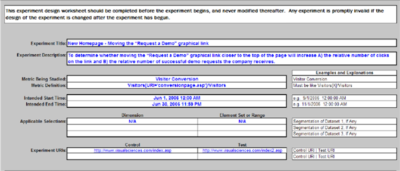
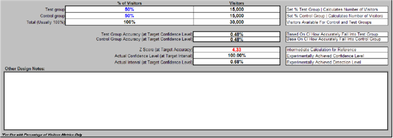

# 실험 설계 스프레드시트{#experiment-design-spreadsheet}

{{eol}}

이 파일은 워크시트 기능뿐만 아니라 실험에 대한 의사 결정 기록으로도 작동합니다.

실험 디자인에 도움이 필요한 경우 Adobe에서 제공하는 실험 설계 스프레드시트(기본적으로 VS Controlled Experiment Design.xls)를 사용할 수 있습니다.

실험 설계 스프레드시트는 문제의 지표가 일부 기준을 충족하는 방문자의 백분율로 정의된 경우에만 유용한 통계 참조를 제공할 수 있습니다. 즉, 방문자 기반 지표 가설을 테스트할 때만 유용합니다.

**실험 설계 파일을 사용하여 실험을 디자인하려면**

1. 웹 또는 응용 프로그램 서버에 대한 관리자 액세스 권한이 있는 경우 [!DNL Sensor] 설치 폴더 [!DNL Sensor] 웹 클러스터의 컴퓨터 관리자 액세스 권한이 없는 경우 Adobe 계정 관리자에게 문의하여 파일을 요청하십시오.
1. VS 통제 실험 Design.xls 파일을 엽니다. (원하는 경우 이 파일의 이름을 변경할 수 있습니다.)

   다음 페이지의 스프레드시트는 이 안내서 전체에서 사용되는 예제 가설을 테스트하기 위해 준비할 때 스프레드시트를 완료하는 방법의 예입니다.

   

   

   

1. 다음 표에 설명된 대로 이 파일의 모든 필드에 대한 텍스트나 값을 파란색으로 입력합니다. 계산된 필드는 두 번째 테이블에 정의되어 있습니다.

<table id="table_C343F7A4BF3D4E0E9A5E9739EC7C2E10"> 
 <thead> 
  <tr> 
   <th colname="col1" class="entry"> 이 필드에서... </th> 
   <th colname="col2" class="entry"> 분류에 사용할 </th> 
  </tr> 
 </thead>
 <tbody> 
  <tr> 
   <td colname="col1"> 실험 제목 </td> 
   <td colname="col2"> 실험을 설명하는 이름입니다. </td> 
  </tr> 
  <tr> 
   <td colname="col1"> 실험 설명 </td> 
   <td colname="col2"> 실험에 대한 텍스트 설명입니다. </td> 
  </tr> 
  <tr> 
   <td colname="col1"> 연구 중인 지표 </td> 
   <td colname="col2"> 
실험이 기반으로 하는 지표의 이름입니다. 
 
예: 방문자 전환 
 </td> 
  </tr> 
  <tr> 
   <td colname="col1"> 지표 정의 </td> 
   <td colname="col2"> 
실험이 기반으로 하는 지표의 정의. 
 
형식: 방문자[X]/방문자 
 
예:  Visitor[URI='conversionpage.asp']/Visitor
 </td> 
  </tr> 
  <tr> 
   <td colname="col1"> 예상 시작 시간 </td> 
   <td colname="col2"> 실험을 시작할 날짜와 시간입니다. </td> 
  </tr> 
  <tr> 
   <td colname="col1"> 예상 종료 시간 </td> 
   <td colname="col2"> 실험을 종료할 날짜와 시간입니다. </td> 
  </tr> 
  <tr> 
   <td colname="col1"> 적용 가능한 선택 </td> 
   <td colname="col2"> (선택 사항) 데이터 세트를 추가로 세그먼트화할 차원 이름 및 요소 세트 또는 범위입니다. </td> 
  </tr> 
  <tr> 
   <td colname="col1"> 실험 URI </td> 
   <td colname="col2"> 가설에 관련된 URI입니다. 컨트롤 그룹에 대한 현재 URI와 테스트 그룹에 대해 만들었거나 만들 대체 URI를 정의합니다. </td> 
  </tr> 
  <tr> 
   <td colname="col1"> 애플리케이션 선택에 대한 예상 지표 </td> 
   <td colname="col2"> 웹 사이트에 대해 예상되는 지표 값에 대한 제목. </td> 
  </tr> 
  <tr> 
   <td colname="col1"> 일별 평균 방문자 수 </td> 
   <td colname="col2"> 하루 평균 웹 사이트 방문자 수입니다. </td> 
  </tr> 
  <tr> 
   <td colname="col1"> 방문자 전환 </td> 
   <td colname="col2"> 웹 사이트에 대한 평균 방문자 전환율입니다. </td> 
  </tr> 
  <tr> 
   <td colname="col1"> 실험 테스트 그룹의 지표 이름이 ...인지 확인합니다. </td> 
   <td colname="col2"> 지표 값을 비교하는 방법에 대한 제목. </td> 
  </tr> 
  <tr> 
   <td colname="col1"> 컨트롤 그룹 값보다 큰 경우 </td> 
   <td colname="col2"> 실험 중에 테스트 그룹의 지표가 증가했다고 결론짓는 기능을 만들려면 이 필드를 True로 설정합니다. 결론을 도출하는 데 필요한 방문자 수를 줄이려면 이 필드를 False 로 설정하십시오. Adobe은 이를 True로 설정할 것을 권장합니다. </td> 
  </tr> 
  <tr> 
   <td colname="col1"> 컨트롤 그룹 값보다 작습니까? </td> 
   <td colname="col2"> 실험 중에 테스트 그룹의 지표가 감소한다고 결론 내리는 기능을 만들려면 이 필드를 True로 설정합니다. Adobe은 이를 True로 설정할 것을 권장합니다. </td> 
  </tr> 
  <tr> 
   <td colname="col1"> 최소(검색 수준) </td> 
   <td colname="col2"> 테스트 그룹에 대한 지표가 제어 그룹에 대한 지표보다 높거나 낮아야 하는 백분율입니다. </td> 
  </tr> 
  <tr> 
   <td colname="col1"> 최소 신뢰 수준 사용 </td> 
   <td colname="col2"> 테스트 그룹 값에 대해 원하는 신뢰 수준. 신뢰 수준 은 지정된 기대가 참일 가능성을 측정할 긍정 오류(false positive)의 수를 결정합니다. </td> 
  </tr> 
  <tr> 
   <td colname="col1"> 및 </td> 
   <td colname="col2"> 테스트 그룹 값에 대해 원하는 전원 수준입니다. 전원 레벨은 잘못된 네거티브의 수를 결정합니다. </td> 
  </tr> 
  <tr> 
   <td colname="col1"> 방문자 비율 </td> 
   <td colname="col2"> 방문자 값의 비율(%)에 대한 제목. </td> 
  </tr> 
  <tr> 
   <td colname="col1"> 테스트 그룹 </td> 
   <td colname="col2"> 테스트 그룹에 포함할 방문자의 백분율입니다. 방문자 섹션의 합계(일반적으로 100%) 필드에 있는 값이 다음 표에 설명된 최소 방문자 필수(테스트+제어 그룹) 필드의 값보다 크거나 같을 때까지 이 숫자로 재생할 수 있습니다. </td> 
  </tr> 
  <tr> 
   <td colname="col1"> 컨트롤 그룹 </td> 
   <td colname="col2"> 컨트롤 그룹에 포함할 방문자의 백분율입니다. </td> 
  </tr> 
  <tr> 
   <td colname="col1"> 기타 디자인 노트 </td> 
   <td colname="col2"> 나중에 참조할 수 있도록 저장할 모든 메모입니다. </td> 
  </tr> 
 </tbody> 
</table>

나머지 필드는 입력한 값을 기반으로 계산되며 다음 표에 설명되어 있습니다.

| 필드 | 설명 |
|---|---|
| 애플리케이션 선택에 대한 예상 지표 | 웹 사이트에 대해 예상되는 지표 값에 대한 제목. |
| 기간별 예상 방문자 수 | 이 필드는 일반적으로 스프레드시트에 의해 자동으로 계산됩니다. 이 보고서는 대부분의 일 웹 사이트에서 재방문자보다 훨씬 더 많은 새 방문자를 수신하는 가정 하에 사용됩니다. 그렇지 않은 경우, 이 셀의 계산은 실험 중에 예상되는 실제 방문자 수로 덮어써야 합니다. |
| 유형 I 오류에 대한 계산된 Z 점수 | 잘못된 양수 결과에 대한 Z 점수입니다. 이것은 중간 통계 계산이다. |
| 유형 II 오류에 대한 계산된 Z 점수 | 잘못된 음수 결과에 대한 Z 점수입니다. 이것은 중간 통계 계산이다. |
| 필요한 최소 방문자 수(Test+Control 그룹) | 지정된 신뢰 수준, 전원 수준 및 Z 점수를 충족하기 위해 실험에 필요한 최소 방문자 수는 기간 당 예상 방문자 필드에 값의 백분율로 표시됩니다. |
| 필요한 최소 방문자 수(Test+Control 그룹) | 지정된 신뢰 수준, 전원 수준 및 Z 점수를 충족하기 위해 테스트에 필요한 최소 방문자 수입니다. 이 값은 방문자 섹션의 합계(일반적으로 100%) 필드에 있는 값보다 작거나 같아야 합니다. |
| 최소 실험 시간(일) | 지정된 신뢰 수준, 전원 수준 및 Z 점수를 충족하기 위해 실험을 실행하는 데 필요한 최소 일 수입니다. 이 계산된 숫자는 기간별 예상 방문자 필드에서 설명한 것과 동일한 문제를 따릅니다. 재방문자가 많은 웹 사이트의 경우 최소 실험 시간(일) 필드는 고유 방문자 수가 최소 방문자 필수 필드의 값과 같은 값을 보는 데 걸리는 예상 일수입니다. |
| 방문자 수 | 방문자 값에 대한 제목. |
| 테스트 그룹 | 테스트 그룹에 필요한 방문자 수입니다. |
| 컨트롤 그룹 | 컨트롤 그룹에 필요한 방문자 수입니다. |
| 합계(일반적으로 100%) | 실험에 필요한 총 방문자 수 이 값은 필요한 최소 방문자 수(테스트+제어 그룹) 필드의 값보다 크거나 같아야 합니다. |
| 테스트 그룹 정확도(Target 신뢰도 수준) | 테스트 그룹에 대해 계산된 지표의 측정값이 실제 값의 이 백분율 내에 있을 것으로 지정된 신뢰 수준과 동일한 가능성이 있음을 나타내는 백분율입니다. |
| 컨트롤 그룹 정확도(Target 신뢰도 수준) | 지정된 신뢰 수준과 동일한 가능성이 있음을 나타내는 백분율로, 통제군에 대해 계산된 지표의 측정값이 실제 값의 이 백분율 내에 있음을 나타냅니다. |
| Z 점수(Target 정확도) | 테스트 평균에서 주어진 값이 갖는 표준 편차의 수입니다. |
| 실제 신뢰 수준(Target 간격) | 실험에 대한 신뢰 수준. 신뢰 수준은 명시된 기대가 참일 가능성을 측정합니다. |
| 실제 간격(Target 신뢰 수준) | 알 수 없는 모집단 매개 변수를 포함할 수 있는 예상 값 범위를 제공하는 실험에 대해 달성된 신뢰 구간. 이 범위는 주어진 샘플 데이터 세트에서 계산됩니다. |

필요한 최소 방문자 수(테스트+제어 그룹) 필드에서 값을 확인해야 합니다. . .

및에서 [합계] 필드의 값과 비교합니다 [!DNL Visitors] 열.

실험이 통계적으로 유효하려면 합계(일반적으로 100%) 필드의 값이 필요한 최소 방문자 수(테스트+제어 그룹) 필드의 값보다 크거나 같아야 합니다.

제공된 입력 시 예제 워크시트에서는 입력된 95%의 신뢰도를 달성하기 위해 10,475명의 방문자가 이 실험에 참여해야 한다는 것을 보여줍니다(이 숫자를 늘릴 수 있지만 모든 통제 실험은 최소 제안된 신뢰도임). 현재 설계된 이 실험에는 30,000명의 방문자가 포함되는데, 이것은 필요한 최소 방문자 수를 훨씬 넘는 방문자입니다.

일수를 동일하게 유지하는 경우 총 방문자 수가 만남을 계속하거나 필요한 최소 방문자를 초과하는 한 신뢰 수준을 높일 수 있습니다.

1. 레코드의 파일을 저장한 다음 파일의 정보를 사용하여 실험 구성 스프레드시트를 사용하여 실험을 구성합니다. 이 스프레드시트에 대한 자세한 내용은 [실험 구성 및 배포](../../home/c-undst-ctrld-exp/t-crt-ctrld-exp/c-cnfg-dply-exp.md#concept-50f1de0242904698937bb72b3ea1b429).
