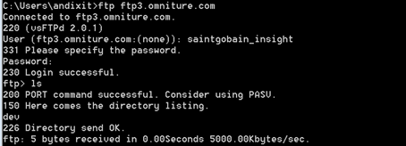

# 내부 및 외부 FTP 서버 유효성 검사{#validation-of-internal-and-external-ftp-servers}

내부 및 외부 FTP 설정의 유효성을 확인하는 데 필요한 최소 단계를 제공하는 빠른 안내서입니다.

내부 FTP는 Adobe 내부 컨설턴트/설계자가 파일 업로드 또는 다운로드를 위해 FTP 사이트에 연결해야 할 때 사용됩니다. 반면에 외부 FTP는 주로 필요한 데이터 파일을 업로드하는 사용자로 사용됩니다.

FTP 서버 설정에 대한 자세한 내용은 [파일 전송 프로토콜](https://experienceleague.adobe.com/docs/analytics/export/ftp-and-sftp/ftp-overview.html?lang=ko-KR)을 참조하십시오.

## 유효성 검사 단계 - 외부 FTP {#section-24428111b5c542ce81a765cd63424b97}

1. 명령 프롬프트를 엽니다. (Windows+R 및 type cmd)
1. ftp `<ftp server>` 입력
1. 사용자 이름과 암호를 입력합니다. 

1. 일부 파일을 이동할 수 있는 로컬 디렉토리를 변경합니다. 다음 명령을 사용합니다.

[!DNL ftp> lcd C:\Users\andixit\Desktop]

로컬 디렉터리는 이제 [!DNL C:\Users\andixit\Desktop] 입니다.

1. 파일을 로컬 위치에서 원격 위치로 복사합니다. 

1. 원격 서버에서 로그아웃합니다. (아래 명령 사용)

[!DNL ftp> bye]

[!DNL 221 Goodbye]

>[!NOTE]
>
>FTP를 확인하는 또 다른 방법은 Filezilla를 사용하는 것입니다. 호스트 이름, 사용자 이름, 암호 및 포트를 입력합니다. 패널의 오른쪽은 원격 사이트이고 왼쪽은 로컬 사이트입니다. FTP의 유효성을 검사하려면 파일을 로컬 사이트에서 원격 사이트 및 v.v로 드래그하여 놓습니다.

## 유효성 검사 단계 - 내부 FTP {#section-b1f7a789ad6848cf9027f7953d81066e}

위의 단계를 수행하여 모든 Adobe 서버에서 내부 ftp의 유효성을 검사할 수 있습니다.
