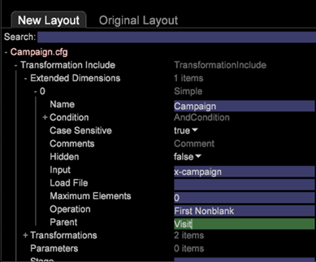

# 새 스키마에 대한 구성 변경 사항{#configuration-changes-for-new-schema}

{{eol}}

이 문서에서는 새 스키마가 배치된 후 모든 기본 Data Workbench 구성을 변경하는 방법을 설명합니다.

## 데이터 집합 스키마 이해 {#section-2ffac5170c894781bc943565af7ad479}

데이터 세트 스키마의 기본 구성은 Data Workbench 웹 분석 스키마의 뼈대를 구성하는 주요 관계 세트로 구성됩니다. 다음 예에서 일반적인 웹 분석 스키마는 방문자, 방문 및 페이지 보기 간의 관계에 대한 아이디어를 제공합니다. 

* 주어진 방문자에게 하나 이상의 방문이 있을 수 있습니다.
* 주어진 방문은 한 명의 방문자만 생성됩니다.
* 주어진 방문에는 하나 이상의 페이지 보기가 포함될 수 있습니다.
* 주어진 페이지 보기는 한 번의 방문에만 속합니다. `<discoiqbr>`

웹과 비즈니스 세계가 여러 해 동안 발전하면서 웹 및 데이터 분석의 요구 사항도 변화했습니다. 웹 사이트는 콘텐츠를 보는 장소로 시작되었습니다. 이제, 컨텐츠를 볼 수 있습니다. 대화, 비디오 또는 제출을 통해 대화식으로 대응합니다. 구매 제품 더 많은 것을 제공합니다. 또한 기업은 웹 데이터를 비즈니스 내의 다른 데이터 채널과 통합하여 전반적인 비즈니스 뷰를 확보하고자 합니다. 예를 들어 기업은 웹, 콜 센터, 이메일, 소셜, 저장 및 고객 데이터를 함께 통합하려고 할 수 있습니다. 오프라인 및 온라인 채널의 이러한 통합을 통해 데이터 세트 스키마는 두 개의 데이터 세트 스키마가 동일한 수년 동안 진화되었습니다.

`<discoiqbr>`온라인 및 오프라인 데이터를 통합할 때 &quot;방문자&quot;라는 용어가 항상 적절하지는 않습니다. 따라서 방문자 대신 &quot;고객&quot;이라는 용어가 사용되는 경우가 있습니다.  

참여 수준은 여러 데이터 소스의 데이터가 있을 때 단일 시간 보기를 활성화하는 데 사용됩니다. 예를 들어 다음과 같은 단일 데이터 소스만 있다고 가정합니다. 웹 사이트에서 방문자 활동에서 수집한 전자 상거래 데이터. 이 경우 방문 수준은 해당 방문자로부터 사이트에 대한 방문을 나타냅니다. 시간 차원 - &#39;일&#39;, &#39;주&#39;, &#39;월&#39; 등은 - 은 일반적으로 &#39;방문&#39; 수준에서 캡처됩니다.

마찬가지로 &quot;이벤트&quot; 수준은 참여 중에 발생한 모든 이벤트(페이지 보기, 콜 센터 호출 등)를 가져옵니다. 참여 중에 고객에 대한 모든 온라인 및 오프라인 이벤트를 결합합니다.

## DWB의 새 계산 가능한 구조 {#section-b77638ec04e4441cb51c56fd3d4abeb6}

새 스키마 구조는 방문자를 고객별, 방문별 참여 및 이벤트별 히트로 대체합니다. 

## 새 데이터 집합 스키마에 따른 구성 변경 사항 {#section-27135515be5c471ba2ee879d1ef4771f}

데이터 집합 스키마를 방문자에서 고객으로 변경하려면 다음 구성 파일을 변경해야 합니다.

1. 가산 및 확장 차원이 정의된 데이터 세트 폴더의 모든 구성 파일입니다. 

1. Dimension 폴더 아래의 구성 파일에서 &quot;방문자&quot;, &quot;방문&quot; 또는 &quot;이벤트&quot;를 레벨로 사용합니다.

   예: Campaign.cfg 파일입니다. Adobe SC 프로필에서 Campaign은 방문 수준에서 정의됩니다. 

   다음 예제에서는 상위 스키마 변경 사항이 방문-참여로 변경된다는 아이디어를 제공합니다. 

1. 일부 지표는 계산 가능한 순서대로 파생되거나 작성되므로 지표 폴더 아래의 구성 파일을 수정하거나 만들어야 합니다.

   예: 새 지표 만들기 [!DNL Customers.metric with formula = sum(one,customer)] 또는 페이지 보기 수.지표로 사용 *정의* 히트 수준에서 표시됩니다. 지표를 수정한 다음 수준을 히트 대신 이벤트 로 변경합니다.

   Adobe: 히트 수준에서 정의된 SC 페이지 보기 횟수 지표: 

   `<discoiqbr>` `<discoiqbr>`다음은 새 스키마에 대한 페이지 보기 수입니다. 

1. 변경 *order.txt* 지표 폴더에 저장되므로 고객, 참여 및 이벤트와 관련된 새 지표나 수정된 지표를 반영합니다.

   Adobe *SC order.txt* 파일. 

   *Order.txt* 새 스키마 변경 사항이 포함된 파일: 

1. 시각화 폴더 아래의 모든 구성 파일(.vw)은 새 수준을 나타내도록 변경해야 합니다. 고객, 참여 및 이벤트. 예: 2D 프로세스 맵, 3D 프로세스 맵 등

   2D 프로세스 맵에 대한 Adobe SC 기본 URI.vw는 아래와 같이 히트 수준 및 방문 그룹에서 정의됩니다. 

   새 스키마에 대한 URI.vw에서 변경할 내용: 
