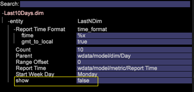

# 파생 차원 설정{#derived-dimensions-setup}

다양한 유형의 파생(클라이언트측) 차원 및 데이터 워크벤치에서 차원을 설정하는 방법입니다.

## 파생된 차원 유형 {#section-33e6dcc9ab9745de9b830cecb2427ca3}

**지표 차원**

지표 차원을 사용하면 특정 수준별로 지표 카운트를 그룹화할 수 있습니다. 또한 특정 수준별로 지표 카운트를 그룹화할 수 있습니다. 지표 차원이 생성되면 지표 값을 기반으로 데이터를 세그먼트화할 수 있습니다.

예 1:여행사인데 자주 방문하는 항공사와 5번 미만의 항공권을 예약한 고객 간의 웹 사이트 행동 활동의 차이를 알고 싶으십니까?

예약만 지표로 계산하면 웹 사이트에서 고객의 행동을 이해할 수 있도록 여기에서 지표를 기반으로 고객을 세그먼트화하는 방법은 무엇입니까?

예 2:파이낸스 뱅크의 경우 고객이 투자한 CD를 기준으로 고객을 그룹화하고자 합니다. 고객을 3등급으로 세분화하고 계층 1 - 10개 이상의 CD를 보유한 고객, 계층 2 - 5개 이상의 CD와 Tier 3를 보유한 고객 - 0개 이상의 CD와 &lt;5개 CD를 보유한 고객

보유하고 있는 정보는 CD 투자 카운트를 제공하는 지표입니다. 분석을 위해 피곤한 고객 세그먼트를 만드는 방법은 무엇입니까?

*지표 차원 만들기 - 워크스테이션을 통해*

OOB 지표 차원 중 하나를 로컬로 표시하고 사용자 지정 이름으로 해당 차원 이름 바꾸기 / RenameDim.example의 로컬 복사본을 만들고 .dim 확장자를 사용하여 적절한 차원 이름으로 변경합니다.

워크스테이션에서 새로 생성된 차원을 열어 변경합니다. 요구 사항에 따라 지표 차원의 다음 매개 변수를 변경합니다. 

지표 - 그룹화할 지표

수준 - 지표를 그룹화할 수준

버킷 시작 - 지표 차원의 시작 요소입니다. 오프셋에 동일한 값을 입력합니다.

버킷 크기 - 지표의 그룹화 크기입니다. 동일한 값을 척도로 입력

버킷 수 - 차원에 표시할 최대 요소 수

새로 만든 차원을 다른 사람과 공유하려면 서버에 저장합니다.

**접두사 차원**

Prefix 치수의 주요 목적은 원본 차원의 요소를 그룹화하고 그룹화된 요소에 친숙한 이름을 제공하는 것입니다.

예를 들어 소매 사이트를 소유하고 있는 사용자의 사이트에는 여성복, 남성복, 장난감 및 게임, 홈 데코 등과 같은 다양한 사이트 섹션이 있으며 이러한 각 사이트 섹션에는 몇 개의 관련 페이지가 있습니다. 경로 분석을 수행하고 한 사이트 섹션에서 다른 사이트 섹션으로 이동하는 트래픽에 대한 통찰력을 얻고자 합니다. URI 차원을 사용하는 경우 경로 브라우저 또는 프로세스 맵에서 각 사이트 섹션의 각 페이지를 가져와서 분석해야 합니다.

사이트 섹션의 페이지를 단일 요소로 그룹화하는 접두어 차원이 있는 경우 동일한 분석을 손쉽게 수행할 수 있습니다.

접두사 차원 만들기:

시각화 메뉴에서 2D 프로세스 맵을 엽니다.

요구 사항에 따라 접두사 차원의 다음 매개 변수를 변경합니다.

맵 변경 차원 - 2D 프로세스 맵에 사용할 차원(예:SMS 유형 분석)

맵 레벨 차원 변경 - 위에 언급된 차원의 레벨

맵 클립 차원 변경 - 데이터를 보려는 계산 가능한 수준입니다.

맵 지표 변경 - 보려는 지표입니다.

2D 프로세스 맵이 설정되면 변경 맵 차원 매개 변수에서 언급한 차원을 엽니다.

그룹화할 요소를 선택합니다. Ctrl+Alt를 사용하여 요소를 드래그하여 놓아 맵을 처리할 수 있습니다.

나타나는 점을 마우스 오른쪽 단추로 클릭하고 그룹 이름을 변경합니다. 그룹화할 3개의 요소를 선택한 경우 기본 이름은 3개가 선택됩니다.

시각화의 개요를 마우스 오른쪽 단추로 클릭하고 나타나는 메뉴에서 차원을 저장합니다.

**차원 이름 변경**

차원 이름 바꾸기는 기존 차원에서 생성됩니다. 이름 바꾸기 차원의 주요 목적은 차원의 요소에 대해 사용자에게 친숙한 이름을 제공하는 것입니다. 기본적으로 이름 바꾸기 차원은 URI 차원에서 생성되는 페이지 차원입니다. URI 차원은 페이지의 기술 이름을 모르는 사용자에게 혼동을 줄 수 있으며 페이지 차원을 통해 URI 차원의 요소 이름을 변경할 수 있습니다.

사용자 정의 이름 바꾸기 차원 만들기:

이름이 바뀐 차원의 요소에는 원래 기본 차원의 요소와 함께 일대일 매핑이 포함됩니다. 워크스테이션/노트 패드에서 치수 이름 바꾸기(Rename Dimension)의 .dim 파일을 열어 확인할 수 있습니다. 원본 차원의 각 요소에는 파일에서 해당 요소에 대해 하나의 값(문자열 이름 변경)만 있습니다.

이름 바꾸기에 사용할 요소가 적은 경우워크스테이션에서 .dim 파일을 만들고 아래 설명된 단계에 따라 각 개별 요소의 이름을 변경할 수 있습니다.

치수 이름 바꾸기에 대한 .dim 파일을 만드는 단계 - 워크스테이션 사용

이름을 변경할 요소 수가 적은 경우 이 옵션을 사용합니다.

1. 빈 작업 영역을 열고 차원 관리자를 엽니다. 마우스 오른쪽 단추 클릭>관리>프로필>프로필 관리자.
1. 파일 열에서 차원 폴더를 확장합니다.
1. 파일 열에서 페이지 폴더를 확장하고 Second to Last 열의 Page.dim 파일을 마우스 오른쪽 단추로 클릭(이 열은 일반적으로 프로필 이름 표시)하고 &quot;로컬로 만들기&quot; 옵션을 클릭합니다.
1. &quot;사용자&quot; 열에서 Page.dim을 마우스 오른쪽 단추로 클릭하고 복사 옵션을 클릭한 다음 복사한 .dim 파일을 차원 디렉토리 아래의 원하는 폴더에 붙여넣기를 클릭합니다.
1. 오류 메시지에서 확인을 클릭합니다.
1. 이제 차원 폴더 아래에 두 개의 Page.dim 파일이 있습니다. 하나는 Dimensions\Page 디렉토리 아래에 있는 원본 파일이고 다른 하나는 4단계에서 복사하여 붙여넣은 파일입니다.
1. [사용자] 열 아래에 있는 최근에 붙여 넣은 Page.dim 파일을 마우스 오른쪽 단추로 클릭하고 Page.dim이라는 파란색/회색 입력 상자를 클릭합니다. 입력 상자가 깜박이는 상태에서 녹색이 되어 수정할 수 있음을 나타냅니다. 생성할 이름 바꾸기 차원의 이름을 입력합니다.
1. 파일 열의 Page.dim 파일이 7단계에서 지정한 새 파일 이름으로 변경되었습니다. 사용자 열(마지막 열)에서 new.dim 파일을 마우스 오른쪽 단추로 클릭하고 열기>워크스테이션에서 을 선택합니다.
1. .dim 파일이 워크스테이션에서 열리면개체 옆에 있는 더하기 기호(+)를 클릭하고 확장합니다. &quot;상위&quot; 필드에 있는 값을 관찰하면 &quot;URI&quot; 차원이 반영됩니다. &quot;wdata/model/dim/URI&quot;가 표시됩니다. 파란색/회색 입력 상자를 클릭하여 URI를 이름을 바꾸려는 요소가 있는 차원의 이름으로 변경합니다.
1. 이름을 바꾸려는 차원이 데이터 세트에 있는지 확인합니다. 차원 이름은 대/소문자를 구분하므로 원래 차원의 대/소문자를 유지합니다.
1. 차원 이름 옆에 나타나는 &quot;수정됨&quot;을 확인합니다. 이것은 원래 차원이 수정되었음을 나타냅니다. 9단계에서 변경된 내용을 유지하려면new.dim(수정됨)을 마우스 오른쪽 단추로 클릭하고 &quot;다른 이름으로 저장&quot; 옵션을 클릭합니다.
1. 10단계별로 차원이 저장되면, 이제 이름을 변경할 목적으로 캠페인에 대해 새로 만든 이름 변경 차원을 사용할 수 있습니다. 지역에서만 사용할 수 있습니다.
1. 다른 사람이 사용자가 생성한 차원을 보려면 프로파일에 저장해야 합니다. &quot;사용자&quot; 열(마지막 열)에서 새 차원의 .dim 파일을 마우스 오른쪽 단추로 클릭하고 차원을 저장할 &quot;프로필 이름&quot;을 클릭합니다.
1. 파일을 프로필에 저장한 후 이 프로필에 액세스할 수 있는 모든 워크스테이션 사용자는 캠페인에 대한 이름 변경 차원을 볼 수 있습니다.

Prefix and Rename dim creator Tool

Adobe에는 접두어 및 차원 이름 변경을 생성하는 Excel 도구가 있습니다.

다음은 도구를 사용하여 접두사/이름 바꾸기 차원을 생성하는 단계입니다.

1. Excel 도구 Adobe_DWB_ *Dimension_Generator.xlsm을* 폴더에 저장합니다. Adobe 고객 지원 센터에 문의하여 도구를 다운로드하십시오.
1. 도구를 열고 매크로를 활성화합니다. 

1. 사용할 값으로 데이터 시트를 채웁니다.

   예를 들어 제품 차원을 기반으로 제품 브랜드 접두사 차원을 만듭니다. 데이터 시트에서 다음 정보가 캡처됩니다. 

   각 제품은 데이터 시트의 브랜드에 할당됩니다.

1. 구성 탭에서 생성할 차원과 관련된 정보를 입력합니다. 아래 정보 위의 샘플 데이터를 입력했습니다. 

   이름:접두사/이름 바꾸기 차원의 이름

   유형:접두사/이름 바꾸기

   소스 치수:원본 차원

   열 일치:일치할 열

   결과 열:새 차원에 사용할 값입니다.

1. 여기를 *클릭하십시오 단추를 클릭합니다*. 

1. dim 파일은 도구가 저장된 동일한 폴더에 생성됩니다. 

   프로필 관리자를 사용하여 치수 폴더에 치수 파일을 저장합니다.

**차원 이동**

Shift 차원을 사용하면 특정 계산 가능한 차원 내에서 차원의 N번째 요소를 볼 수 있습니다.

또한 특정 계산 가능한 차원 내의 모든 차원의 -Nth 요소를 볼 수 있습니다

예제 1:

* 세션 내의 N번째 페이지 - 다음 페이지 차원
* 방문자의 Nth 페이지 - 모든 세션에서 방문자의 다음 페이지
* 사용자에 대한 N번째 호출

계산 가능한 차원의 Nth 요소를 아는 것이 중요한 이유는 무엇입니까?

* 세션에서 본 5번째 페이지를 알고 싶은 경우
* &quot;무료 확인 계정&quot; 캠페인을 본 후 본 2차 캠페인을 파악하기 위해 캠페인에 대한 경로 지정을 원하십니까?
* &quot;에이전트와 채팅&quot; 링크를 클릭하기 전에 클릭한 링크 방문자를 이해하시겠습니까? 

다음 URI는 템플릿으로 사용할 수 있는 OOB Shift 차원 중 하나입니다. 위의 예는 관여 이벤트(클립 = 관여 이벤트)에서 캠페인(Dim = 캠페인)의 2번째(오프셋 = 1) 요소를 제공합니다.

여기서 offset 1은 이벤트에서 오른쪽을 향하게 됨을 의미합니다

기타 일부 OOB Shift 차원

*다음 페이지:*

페이지 차원에서 현재 선택한 페이지 후 세션에서 본 다음 페이지

오프셋이 1이고, 수준이 페이지 보기이고, 딤은 페이지, 클립은 세션임

*이전 페이지:*

페이지 차원에서 현재 선택된 페이지 이전에 세션에서 본 이전 페이지

여기서 오프셋은 -1, 레벨은 페이지 보기, 딤은 페이지, 클립은 세션임

방문자가 현재 선택한 캠페인에서 이전에 본 이전 캠페인은 무엇입니까?

이 오프셋은 -1, 수준은 캠페인 응답, 딤은 캠페인 응답 속성 값, 클립은 방문자

*Shift 차원 생성 - 워크스테이션을 통해*

* OOB Shift 차원 중 하나를 로컬로 표시
* 사용자 지정 이름으로 차원 이름 바꾸기
* 워크스테이션에서 새로 생성된 차원을 열어 변경
* 요구 사항에 따라 지표 차원의 다음 매개 변수를 변경합니다.

   * 레벨 계산 가능한 차원
   * 옵셋-뒤로 보기를 원하십니까
   * Dim -분석할 요소가 있는 차원
   * 보려는 클립 계산 가능.

* 새로 만든 차원을 다른 사람과 공유하려면 서버에 저장합니다.

**마지막 N 차원**

마지막 N 차원은 시간 차원 및 시스템의 기준 시에서만 작동합니다. OOB 시간 차원은 일, 주, 시간 및 월입니다. 지난 10일, 지난 72시간, 지난 8주, 지난 6개월 등과 같은 이러한 기본 시간 차원에 대해 마지막 N 차원을 만들 수 있습니다. 마지막 N 차원은 시스템의 현재 &quot;보고서 시간 지표&quot; 또는 현재 시간을 기준으로 마지막 N을 계산합니다. 

카운트 - 차원에 표시할 총 요소 수

범위 오프셋 - 시작 지점(일/주)을 나타내는 오프셋 값으로 마지막 N일/주를 계산합니다.

**None.dim**

None.dim은 별칭 차원입니다. 확장 차원에서 별칭을 만드는 데 사용됩니다.

예:

None.dim에서 엔티티는 &quot;wdata/model/dim/Parent/+name&quot;(변경할 수 있음)으로 정의되므로 차원 파일의 이름에 따라 치수를 생성합니다. 따라서 Dimension 폴더 아래에 None.dim 파일의 복사본을 만들고(예: 방문자 프로필 폴더 아래의 None.dim 파일을 복사하거나 이름을 변경하는 경우) 이름을 &quot;Log Source ID.dim&quot;으로 바꾸면 로그 소스 ID가 있는 새로운 파생 차원이 아래와 같이 방문자 프로필 아래의 메뉴에 표시됩니다.

변경 전: 

None.dim 변경 후: 

엔티티는 확장 차원 이름으로 변경할 수 있습니다. 이 경우 다른 이름이 아래와 같은 차원을 가리키는 다른 차원이 있습니다.

이 예에서 &quot;Source Name.dim&quot;에는 다음과 같은 컨텐츠가 있습니다. 

따라서 로그 소스 ID를 가리키는 다른 차원 소스 이름이 나타납니다. 

**파생된 차원 숨기기**

파생 차원을 숨기려면 표시 *속성을 &quot;false&quot;로* 설정합니다. 

