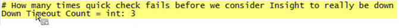

# 모니터링 프로필 설치{#installing-the-monitoring-profile}

데이터 워크벤치 모니터링 프로파일 설치에 대한 지침.

## 설치 단계 {#section-d4355dbea8a447f48ab168db6ccff612}

1. 태그가 있는 웹 페이지 데이터 수집에 사용되는 것처럼 새 센서 인스턴스를 구성합니다. zig.gif 파일이 Sensor 웹 서버 문서 루트에 있는지 확인합니다. 센서는 모니터 프로파일과 동일한 호스트에서 실행할 수 있습니다. 이 용도로 텍스트 파일을 사용하는 경우에는 문제가 되지 않습니다.

   >[!NOTE]
   >
   >이 센서 인스턴스는 모니터링 에이전트의 트래픽만 수신하도록 전용되어야 합니다. 또한 이 컬렉션에 대해 웹 서버를 다시 사용 중인 경우 다른 포트에서 실행되도록 센서를 구성할 수 있습니다.

1. [!DNL txlogd.conf] 파일에는 기본 줄이 있습니다.

   ```
   <b>ContentFilterExclude</b> image/,text/css,application/x-javascript,text/javascript
   ```

   데이터 워크벤치 모니터링 프로필 응용 프로그램(또는 &quot;태그 지정&quot; 페이지 구현)의 경우 GIF 파일을 통해 수집하려면 이미지 유형을 제거해야 합니다. 업데이트된 줄:

   ```
   <b>ContentFilterExclude </b>text/css,application/x-javascript,text/javascript
   ```

1. [!DNL insight_monitor.zip/insight_monitor_agent]을(를) 임시 위치로 복사합니다.
1. 환경에 대해 [!DNL insight_monitor_agent.cfg] 파일을 업데이트합니다. 구성 파일 내의 주석을 따르십시오.

   **모니터링 구성 파일:**

   

   모든 정보를 수집하는 위치를 정의하고 URL 주소를 제공합니다. 이 센서는 전용 센서여야 하며 이 응용 프로그램을 제외하고 트래픽을 받지 않아야 합니다.

   

   e가 있다고 가정할 때 다음과 같은 경로가 있습니다.disk. 환경에 대해 이 경로를 변경할 수 있습니다.

   

   때때로 변형 프로파일을 실행할 때 데이터 워크벤치가 응답하지 않을 수 있습니다. 이 값을 사용하면 프로세스가 응답하지 않을 경우 행에서 3회 경고를 보낼 수 있습니다. 이는 잘못된 양의 경고를 줄이는 방법입니다.

   

   환경 및 그룹 차원을 설정하는 곳입니다. 이는 호스트마다 다를 수 있습니다.

   이 경로는 입니다. 이 경로에서 오류 로그를 보면 모니터 에이전트가 수행하는 작업을 정확하게 확인할 수 있습니다.

   

   임시 DB를 내부적으로 사용하기 위한 것입니다. 용량 도달 시 경고가 표시될 수 있습니다. 실제 디스크 사용과는 다릅니다.

1. 데이터 워크벤치 서버를 실행하는 각 DPU 및 FSU 호스트에 *insight_monitor_agent* 폴더를 복사합니다. 구성 파일에 지정된 기본 위치는 [!DNL e:\insight_monitor_agent]이지만 이 위치를 변경할 수 있습니다.

1. 10분마다 에이전트를 호출하도록 Windows 예약된 작업을 추가합니다(이 기간은 처리율 계산에서 가정됨). 프로그램은 [!DNL e:insight_monitor/insight_monitor_agent.exe]입니다. 인수는 config-file e:\insight_monitor\insight_monitor.cfg입니다. e:\insight_monitor에서 시작합니다. 작업을 실행하는 사용자는 [!DNL e:\insight_monitor]을(를) 읽고 쓸 수 있는 권한이 있어야 하며, Win32 OLE 개체 [!DNL root\CIMV2]을(를) 읽을 수 있습니다(데이터 워크벤치 서버 서비스 시작 모드를 확인하고 로컬 디스크의 공간 비율을 확인하는 데 필요).

1. 모니터 레코드가 누적되어 VSL 파일이 증가하는지 확인합니다. 작은 설치에서는 트래픽 볼륨이 매우 낮으므로 다소 시간이 걸립니다(에이전트가 호스트별 데이터에 대해 하나의 히트를 전송하고 처리 프로필당 하나의 히트를 추가함).
1. insight_monitor.zip\profiles\Insight Historic to a temporary location의 압축을 해제합니다.
1. [!DNL profile.cfg], [!DNL dataset\cluster.cfg] 및 [!DNL dataset\segment export.cfg]에서 호스트 이름을 업데이트합니다.

1. 데이터 워크벤치 프로필 디렉토리로 파일을 업데이트합니다.
1. Sensor VSL이 누적되는 위치로 [!DNL dataset\log processing.cfg]의 로그 서버 및 경로를 업데이트합니다.
1. [옵션] 은 프로필  [!DNL Insight Profile Status] 및  [!DNL Insight Server Status]와 동일하게 수행합니다. 또한 상태 프로필은 후행 2일 창으로 매일 다시 처리되어야 합니다. Windows 예약 작업 추가:프로그램은 [!DNL e:\insight_monitor\insight_reprocess.exe]입니다. 인수는 [!DNL --profile-path="PATH TO PROFILES\insight profile status" --start-days-ago=2]입니다. [!DNL start in]을(를) 비워 두십시오. *&quot;인사이트 서버 상태&quot;*&#x200B;에 대해 다른 예약된 작업을 추가합니다. *insight_reprocess.* exelog는  *log processing.cfgg에 대한 읽기/* 쓰기 액세스 권한이 필요합니다.

1. 또한 상태 프로필은 후행 2일 창으로 매일 다시 처리되어야 합니다. Windows 예약 작업 추가:이 프로그램은 *e:\insight_monitor\insight_reprocess.exe*&#x200B;입니다. 인수는 - [!DNL -profile-path="PATH TO PROFILES\insight profile status" --start-days-ago=2]입니다. *start in*&#x200B;을(를) 비워 두십시오. [!DNL "insight server status"]에 대해 다른 예약된 작업을 추가합니다. [!DNL insight_reprocess.exe] 시작 시간을 업데이트하려면 읽기/쓰기 액세스 [!DNL log processing.cfg] 가 필요합니다. 각 프로파일이 누적되어 모니터 VSL을 읽고 있는지 확인합니다. 다시 말하면, 매우 적은 양 때문에 몇 시간, 아마도 몇 시간이 걸릴 것입니다.

## 설치 정보 {#section-17722441ab0046fcbcb46b957d56230a}

* **라이센스 테스트 환경에서 모니터링 프로필 구성을 참조하십시오**. 테스트 환경 패키지는 데이터 워크벤치 구현에 포함되어 있으므로 응용 프로그램을 설치 및 구성할 수 있습니다. 프로덕션 FSU 또는 DPU 서버에 설치하는 경우 별도의 포트에서 실행되도록 서버를 구성해야 합니다.
* **모니터링 프로파일에 대한 새 센서 배포**. 모니터링 프로파일을 실행하는 서버에 새로운 센서 인스턴스를 설치해야 합니다. 이것은 센서의 생산 인스턴스 이외에도 있습니다. (모니터링 프로파일을 위해 프로덕션 서버 또는 비프로덕션 서버에 센서를 설치하는 경우에는 추가 비용이 없습니다.)
* **데이터 워크벤치 유지 관리** 중에 모니터 에이전트를 비활성화합니다. 가동 시간 및 성능 측정 지표를 훼손하지 않도록 서비스 시작 모드를 서비스 InsightServer(Omniture Insight Server)에 대해 수동으로 설정할 수 있습니다. 간편한 PowerShell 명령은 *set-service -name insightserver -startuptype manual*&#x200B;입니다. 유지 관리 후 다시 자동으로 설정합니다.*set-service -name insightserver -startuptype automatic*. 모니터 에이전트 예약 작업을 일시적으로 비활성화하는 방법도 있습니다.
* **상태 프로필에는 이전 호스트 프로필** 매핑뿐만 아니라 뒤에 있는 창이 필요합니다. 그러나 이벤트 데이터의 양이 너무 작아서 데이터 워크벤치가 버퍼링하지 않을 경우, 처리를 위해 윈도우 크기를 꽤 연장해야 할 수도 있습니다.
* **에이전트는 이벤트 데이터 로그 시간 스탬프가 UTC(VSL 파일에서와 같이)를 가정할 때 로컬 호스트 시간으로 보고되는 데이터 워크벤치의 세부 상태** 및 가장 오래된 시간을 수집합니다. 이벤트 데이터 타임스탬프가 UTC가 아닌 시간대인 경우 기준 시간은 결과 Insight 프로필 상태 프로필에서 오프셋됩니다. 이벤트 데이터 타임스탬프의 **모든**&#x200B;이(가) 동일한 시간대에 있는 경우 *인사이트 프로필 Status\metrics\as of delay minutes.metric*&#x200B;에 해당 오프셋을 추가할 수 있습니다.

* **고객이 다른 상태의 프로덕션, 스테이징, 테스트 서버 및 서버와 같이 서로 다른** 상태에 있을 경우 서버를 그룹화하는 데 도움이 되는 2개의 새로운 차원이 도입되었습니다. 예를 들어 &quot;가동 시간&quot;을 찾고 있는 경우 운영 모드에서만 서버를 볼 수 있습니다. 따라서 그룹 차원은 사용자의 요구에 맞게 서버를 임의로 그룹화하는 또 다른 방법입니다. 예를 들어 모니터링 구성 파일에서 작업, 개발 또는 마케팅과 같이 담당 부서가 제공하는 호스트를 설정할 수 있습니다.
