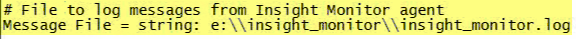

# 모니터링 프로필 설치{#installing-the-monitoring-profile}

데이터 워크벤치 모니터링 프로파일 설치에 대한 지침.

## 설치 단계 {#section-d4355dbea8a447f48ab168db6ccff612}

1. 태그가 지정된 웹 페이지 데이터 수집에 사용될 것처럼 새 센서 인스턴스를 구성합니다. zig.gif 파일이 Sensor 웹 서버 문서 루트에 있는지 확인합니다. 센서는 모니터 프로파일과 동일한 호스트에서 실행할 수 있습니다. 이 용도로 텍스트 파일을 사용하는 경우에는 문제가 되지 않습니다.

   >[!NOTE]
   >
   >이 Sensor 인스턴스는 모니터링 에이전트의 트래픽만 수신하도록 전용되어야 합니다. 또한 이 컬렉션에 대한 웹 서버를 다시 사용하는 경우 센서가 다른 포트에서 실행되도록 구성할 수 있습니다.

1. 파일에 기본 [!DNL txlogd.conf] 줄이 있습니다.

   ```
   <b>ContentFilterExclude</b> image/,text/css,application/x-javascript,text/javascript
   ```

   데이터 워크벤치 모니터링 프로필 애플리케이션(또는 &quot;태그 지정&quot; 페이지 구현)의 경우 GIF 파일을 통해 수집하려면 이미지 유형을 제거해야 합니다. 업데이트된 줄은 다음과 같습니다.

   ```
   <b>ContentFilterExclude </b>text/css,application/x-javascript,text/javascript
   ```

1. 임시 [!DNL insight_monitor.zip/insight_monitor_agent] 위치에 복사합니다.
1. 환경에 맞는 [!DNL insight_monitor_agent.cfg] 파일을 업데이트합니다. 구성 파일 내의 주석을 따르십시오.

   **모니터링 구성 파일:**

   

   모든 정보를 수집하는 위치를 정의하고 URL 주소를 제공합니다. 전용 센서가 필요하며 이 응용 프로그램을 제외하고 트래픽을 받지 않아야 합니다.

   

   e가 있다고 가정할 때 다음과 같은 경로가 있습니다.disk. 환경에 대해 이 경로를 변경할 수 있습니다.

   

   때때로 변형 프로파일을 실행할 때 데이터 워크벤치가 응답하지 않을 수 있습니다. 이 값을 사용하면 프로세스가 응답하지 않을 경우 경고를 3번 연속으로 보낼 수 있습니다. 이는 잘못된 긍정 경고를 줄이는 방법입니다.

   

   여기에서 환경 및 그룹 차원을 설정합니다. 호스트 간 다를 수 있습니다.

   이 페이지에서는 이 경로에서 오류 로그를 확인하여 모니터 에이전트가 수행하는 작업을 정확하게 확인할 수 있습니다.

   

   임시 DB를 내부적으로 사용하기 위한 것입니다. 용량 도달 시 경고가 표시될 수 있습니다. 실제 디스크 사용과는 다릅니다.

1. 데이터 워크벤치 서버를 실행하는 각 DPU 및 FSU 호스트에 *insight_monitor_agent* 폴더를 복사합니다. 구성 파일에 지정된 기본 위치는 [!DNL e:\insight_monitor_agent] 다르지만 이 위치를 변경할 수 있습니다.

1. Windows 예약 작업을 추가하여 10분마다 에이전트를 호출합니다(이 기간은 처리율 계산에서 가정됨). 프로그램은 [!DNL e:insight_monitor/insight_monitor_agent.exe]그렇습니다. 인수는 config-file e:\insight_monitor\insight_monitor.cfg입니다. e:\insight_monitor에서 시작합니다. 작업을 실행하는 사용자는 Win32 OLE 개체를 읽고 [!DNL e:\insight_monitor] [!DNL root\CIMV2] 쓸 수 있는 권한이 있어야 합니다(데이터 워크벤치 서버 서비스 시작 모드를 확인하고 로컬 디스크의 공간 비율을 확인하는 데 필요).

1. 모니터 레코드가 누적되면 VSL 파일이 확장되기 시작하는지 확인합니다. 작은 설치에서는 트래픽 볼륨이 매우 낮기 때문에 시간이 다소 소요됩니다(10분마다 에이전트가 호스트별 데이터에 대해 하나의 히트와 처리 프로필당 하나의 히트만 전송합니다).
1. insight_monitor.zip\profiles\Insight Historic to a temporary location파일의 압축을 해제합니다.
1. [!DNL] [!DNL profile.cfg]및 [!DNL [!DNL dataset\cluster.cfg]]의 호스트 이름을 업데이트합니다 [!DNL dataset\segment export.cfg].

1. 파일을 데이터 워크벤치 프로필 디렉토리로 업데이트합니다.
1. Sensor VSL [!DNL dataset\log processing.cfg] 이 누적되는 위치에 로그 서버 및 경로를 업데이트합니다.
1. [원할 경우] 프로파일과 [!DNL Insight Profile Status] CS3를 사용하여 동일한 작업을 수행할 수 [!DNL Insight Server Status]있습니다. 또한 상태 프로필은 후행 2일 창으로 매일 밤 다시 처리해야 합니다. Windows 예약 작업 추가:프로그램은 [!DNL e:\insight_monitor\insight_reprocess.exe]그렇습니다. 그 주장은 [!DNL --profile-path="PATH TO PROFILES\insight profile status" --start-days-ago=2]그렇다. 비워 [!DNL start in] 둡니다. &quot;인사이트 서버 상태&quot;에 대해 예약된 *다른 작업을 추가합니다*. *insight_reprocess.exe* 시작 시간을 업데이트하려면 *log processing.cfg* 읽기/쓰기 권한이 필요합니다.

1. 또한 상태 프로필은 후행 2일 창으로 매일 밤 다시 처리해야 합니다. Windows 예약 작업 추가:프로그램은 e:\insight_monitor\insight_reprocess.exe *입니다*. 그 주장은 - 입니다 [!DNL -profile-path="PATH TO PROFILES\insight profile status" --start-days-ago=2]. 처음부터 *빈 칸으로* 두십시오. 다른 예약된 작업을 추가합니다 [!DNL "insight server status"]. [!DNL insight_reprocess.exe] 시작 시간을 업데이트하려면 읽기/쓰기 액세스 권한이 [!DNL log processing.cfg] 필요합니다. 각 프로필에서 축적된 모니터 VSL을 읽고 있는지 확인합니다. 다시 말하면, 이 작업은 매우 적은 용량 때문에 몇 시간, 아마도 몇 시간이 걸릴 것입니다.

## 설치 정보 {#section-17722441ab0046fcbcb46b957d56230a}

* **라이센스 테스트 환경에서**&#x200B;모니터링 프로필 구성 테스트 환경 패키지는 데이터 워크벤치 구현에 포함되어 있으므로 애플리케이션을 설치 및 구성할 수 있습니다. 프로덕션 FSU 또는 DPU 서버에 설치하는 경우 별도의 포트에서 실행되도록 서버를 구성해야 합니다.
* **모니터링 프로필에 대한 새 센서 배포입니다**. 모니터링 프로필을 실행하는 서버에 새로운 센서 인스턴스를 설치해야 합니다. 이것은 센서의 생산 인스턴스 외에 추가로 사용됩니다. (모니터링 프로필에 대한 프로덕션 서버 또는 비프로덕션 서버에 센서를 설치하는 경우에는 추가 비용이 들지 않습니다.)
* **데이터 워크벤치 유지 관리**&#x200B;중에 모니터 에이전트를 비활성화합니다. 가동 시간 및 성능 지표를 훼손하지 않도록 서비스 시작 모드를 서비스 InsightServer(Omniture Insight Server)에 대해 수동으로 설정할 수 있습니다. 편리한 PowerShell 명령은 *set-service -name insightserver -startuptype 매뉴얼*. 유지 관리 후 다시 자동으로 설정합니다.set-service -name insightserver -startuptype automatic **. 다른 옵션은 모니터 에이전트 예약 작업을 일시적으로 비활성화하는 것입니다.
* **상태 프로필에는 이전 호스트 및 프로필과 이전 호스트 프로필 매핑을 삭제하려면 후행 창이** 필요합니다. 그러나 이벤트 데이터의 양이 너무 작아 데이터 워크벤치가 버퍼링하지 않을 경우, 처리를 위해 창의 크기를 꽤 연장해야 할 수 있습니다.
* **에이전트는 데이터 워크벤치의 세부 상태**(이벤트 데이터 로그 시간 스탬프가 UTC(VSL 파일에서처럼)를 가정할 때 로컬 호스트 시간으로 보고되는 전체 및 가장 오래된 시간을 수집합니다. 이벤트 데이터 타임스탬프가 UTC 시간대가 아닌 경우 기준 시간은 결과 인사이트 프로필 상태 프로필에서 오프셋됩니다. 이벤트 데이터 타임스탬프가 **모두** 동일한 표준 시간대에 있는 경우 해당 오프셋을 Insight 프로필 Status\metrics\as of delay minutes.metric에 추가할 *수 있습니다*.

* **두 개의 새로운 차원이 고객이 프로덕션, 스테이징, 테스트 서버 및 다른 상태의 서버와 같은 다른 상태에**&#x200B;있을 경우 서버를 그룹화하는 데 도움이 되도록 도입되었습니다. 예를 들어 &quot;가동 시간&quot;을 찾고 있는 경우 운영 모드에서만 서버를 볼 수 있습니다. 따라서 그룹 차원은 사용자의 요구 사항에 맞게 서버를 임의로 그룹화하는 또 다른 방법입니다. 예를 들어 모니터링 구성 파일에서 작업, 개발 또는 마케팅과 같이 귀하의 부서에서 서비스를 제공하는 호스트를 설정할 수 있습니다.

