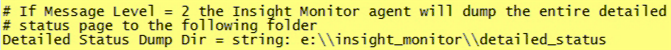

# 모니터링 프로필 설치{#installing-the-monitoring-profile}

{{eol}}

Data Workbench 모니터링 프로필 설치 지침.

## 설치 단계 {#section-d4355dbea8a447f48ab168db6ccff612}

1. 태그된 웹 페이지 데이터 수집에 사용할 것처럼 새 센서 인스턴스를 구성합니다. zig.gif 파일이 Sensor 웹 서버 문서 루트에 있는지 확인합니다. 센서는 모니터 프로필과 동일한 호스트에서 실행할 수 있습니다. (이 용도로 텍스트 파일을 사용하는 경우에는 문제가 되지 않습니다.)

   >[!NOTE]
   >
   >이 센서 인스턴스는 모니터링 에이전트로부터 트래픽만 받는 데 사용해야 합니다. 또한, 이 수집을 위해 웹 서버를 다시 사용하는 경우 센서가 다른 포트에서 실행되도록 구성할 수 있습니다.

1. 에서 [!DNL txlogd.conf] 파일:

   ```
   <b>ContentFilterExclude</b> image/,text/css,application/x-javascript,text/javascript
   ```

   Data Workbench 모니터링 프로필 애플리케이션(또는 &quot;태그가 지정된&quot; 페이지 구현)의 경우 GIF 파일을 통해 수집하려면 이미지 유형을 제거해야 합니다. 업데이트된 라인은 다음과 같습니다.

   ```
   <b>ContentFilterExclude </b>text/css,application/x-javascript,text/javascript
   ```

1. 를 복사합니다. [!DNL insight_monitor.zip/insight_monitor_agent] 임시 위치로 이동
1. 업데이트 [!DNL insight_monitor_agent.cfg] 파일을 사용하십시오. 구성 파일 내의 설명을 따르십시오.

   **모니터링 구성 파일:**

   

   모든 정보를 수집하는 위치를 정의하고 URL 주소를 입력합니다. 이 센서는 전용 센서여야 하며 이 응용 프로그램을 제외하고 트래픽을 받지 않아야 합니다.

   

   e가 있다고 가정하는 경로가 있습니다. 디스크. 환경에 대해 이 경로를 변경할 수 있습니다.

   

   변형 프로필을 실행할 때 Data Workbench가 응답하지 않을 수 있습니다. 이 값을 사용하면 프로세스가 응답하지 않는 행에서 세 번 이상 발생하면 경고를 보낼 수 있습니다. 이는 잘못된 양의 경고를 줄이는 방법입니다.

   

   여기서 환경 및 그룹 차원을 설정합니다. 이는 호스트와 다를 수 있습니다.

   이건 우리야 이 경로에서 오류 로그를 보고 모니터 에이전트가 수행하는 작업을 정확히 확인할 수 있습니다.

   

   temp db를 내부적으로 사용하는 것입니다. 용량 할당 시 경고될 수 있습니다. 실제 디스크 사용과는 다릅니다.

1. 를 복사합니다. *insight_monitor_agent* data workbench 서버를 실행하는 각 DPU 및 FSU 호스트에 폴더를 지정합니다. 구성 파일에 표시된 기본 위치는 다음과 같습니다 [!DNL e:\insight_monitor_agent] 하지만 이 위치를 변경할 수 있습니다.

1. 10분마다 에이전트를 호출하는 Windows 예약 작업을 추가합니다(이 기간은 처리 속도 계산에서 가정). 프로그램은 [!DNL e:insight_monitor/insight_monitor_agent.exe]. 인수는 config-file e:\insight_monitor\insight_monitor.cfg 입니다. e:\insight_monitor에서 시작합니다. 작업을 실행하는 사용자에게 읽기/쓰기 권한이 있어야 합니다. [!DNL e:\insight_monitor] Win32 OLE 개체 읽기 [!DNL root\CIMV2] (data workbench 서버 서비스 시작 모드를 확인하고 로컬 디스크의 공간 비율을 확인하는 데 필요)

1. 모니터 레코드가 누적됨에 따라 VSL 파일이 증가하기 시작하는지 확인합니다. 소규모 설치에서는 트래픽 볼륨이 매우 낮으므로 시간이 좀 걸립니다(10분마다 에이전트가 호스트별 데이터에 대해 히트를 하나만 전송하고 처리 프로필당 히트는 하나씩).
1. insight_monitor.zip\profiles\Insight History 를 임시 위치로 압축 해제합니다.
1. 에서 호스트 이름 업데이트 [!DNL profile.cfg], [!DNL dataset\cluster.cfg], 및 [!DNL dataset\segment export.cfg].

1. 파일을 Data Workbench 프로필 디렉토리에 업데이트합니다.
1. 로그 서버 및 경로 업데이트 위치 [!DNL dataset\log processing.cfg] Sensor VSL이 축적되는 위치로 이동합니다.
1. [원할 경우] 프로필에서도 동일한 작업을 수행합니다 [!DNL Insight Profile Status] 및 [!DNL Insight Server Status]. 또한 상태 프로필은 후행 2일 창으로 매일 밤 다시 처리해야 합니다. Windows 예약 작업 추가: 프로그램은 [!DNL e:\insight_monitor\insight_reprocess.exe]. 인수는 [!DNL --profile-path="PATH TO PROFILES\insight profile status" --start-days-ago=2]. Leave [!DNL start in] 비어 있습니다. 다음에 대해 다른 예약된 작업 추가 *&quot;insight server 상태&quot;*. *insight_reprocess.exe* 읽기/쓰기 액세스 필요 *log processing.cfg* 를 눌러 시작 시간을 업데이트합니다.

1. 또한 상태 프로필은 후행 2일 창으로 매일 밤 다시 처리해야 합니다. Windows 예약 작업 추가: 프로그램은 *e:\insight_monitor\insight_reprocess.exe*. 인수는 - [!DNL -profile-path="PATH TO PROFILES\insight profile status" --start-days-ago=2]. Leave *시작 위치* 비어 있습니다. 다음에 대해 다른 예약된 작업 추가 [!DNL "insight server status"]. [!DNL insight_reprocess.exe] 읽기/쓰기 액세스 필요 [!DNL log processing.cfg] 를 눌러 시작 시간을 업데이트합니다. 각 프로필이 축적될 때 모니터 VSL을 읽고 있는지 확인합니다. 즉, 매우 적은 볼륨 때문에 몇 시간, 즉 몇 시간이 걸릴 수 있습니다.

## 설치 정보 {#section-17722441ab0046fcbcb46b957d56230a}

* **라이선스가 부여된 테스트 환경에서 모니터링 프로필 구성**. 테스트 환경 패키지는 Data Workbench 구현에 포함되어 있으므로 애플리케이션을 설치 및 구성할 수 있습니다. 프로덕션 FSU 또는 DPU 서버에 설치하는 경우 별도의 포트에서 실행되도록 서버를 구성해야 합니다.
* **모니터링 프로파일에 대한 새로운 센서 배포**. 모니터링 프로필을 실행하는 서버에 새 Sensor 인스턴스를 설치해야 합니다. 이것은 센서의 프로덕션 인스턴스 외에 있습니다. (모니터링 프로필에 대한 프로덕션 또는 비프로덕션 서버에 센서를 설치하는 데 추가 비용이 없습니다.)
* **Data Workbench 유지 관리 중에 모니터 에이전트를 비활성화합니다**. 가동 시간 및 성능 지표를 오염하지 않도록 서비스 InsightServer(Omniture Insight Server)에 대한 서비스 시작 모드를 수동으로 설정할 수 있습니다. 편리한 PowerShell 명령은 다음과 같습니다 *set-service -name insightserver -startuptype manual*. 유지 관리 후 다시 자동으로 설정합니다. *set-service -name insightserver-startuptype 자동*. 모니터 에이전트 예약 작업을 일시적으로 비활성화하는 것도 다른 옵션입니다.
* **상태 프로필에는 후행 창이 필요합니다.** 이전 호스트 및 프로필과 이전 호스트 프로필 매핑을 삭제하려면 다음을 수행하십시오. 그러나 이벤트 데이터의 양이 너무 적어 Data Workbench에서 버퍼링하지 않는 경우 처리하는 데 유리창의 크기를 꽤 확장해야 할 수 있습니다.
* **에이전트는 Data Workbench 세부 상태에서 전체 및 가장 오래된 기준 시간을 수집합니다**: 이벤트 데이터 로그 시간 스탬프가 UTC(VSL 파일에서처럼)라고 가정할 때 로컬 호스트 시간으로 보고됩니다. 이벤트 데이터 타임스탬프가 UTC가 아닌 시간대의 경우 기준 시간은 결과 Insight Profile Status 프로필에서 오프셋됩니다. If **모두** 이벤트 데이터 타임스탬프 중에서 해당 오프셋을 추가할 수 있는 시간대가 같은 경우 *Insight Profile Status\metrics\as a delay minutes.metric*.

* **고객이 다른 상태에 있는 경우 서버를 그룹화하는 데 도움이 되도록 두 개의 새로운 차원이 도입되었습니다**&#x200B;프로덕션, 스테이징, 테스트 서버 및 기타 상태의 서버와 같은 경우입니다. 예를 들어 &quot;가동 시간&quot;을 찾고 있다면 운영 모드에서만 서버를 확인할 수 있습니다. 따라서 그룹 차원은 사용자의 요구 사항에 따라 서버를 임의로 그룹화하는 또 다른 방법입니다. 예를 들어 모니터링 구성 파일에서 부서가 서비스하고 있는 작업, 개발 또는 마케팅과 같은 호스트를 설정할 수 있습니다.
