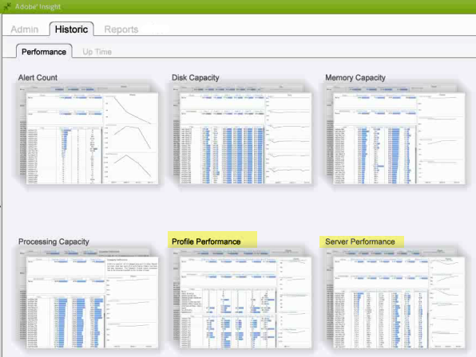
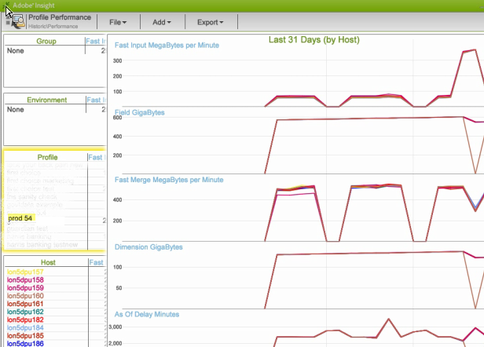

# 데이터 워크벤치 기록 작업 영역{#data-workbench-historic-workspace}

데이터 워크벤치 기록 프로파일을 사용하여 구성, 하드웨어 및 기타 변경 사항이 시간 경과에 따른 성능, 안정성 및 서버 용량에 어떤 영향을 미치는지 확인할 수 있습니다.

기록 프로필에는 프로필 기반 프로필 [성능](../../../home/monitoring-installation/monitoring-profiles/monitoring-historical-using.md#section-184a86f9de054970bf68515bb9dea85d) 데이터 세트와 [탭 아래의 서버 기반](../../../home/monitoring-installation/monitoring-profiles/monitoring-historical-using.md#section-5dad5870384b40e094d50173fcd90a09) 서버 **[!UICONTROL Performance]** 성능데이터집합이포함됩니다. 이는 데이터 워크벤치 서버 성능의 과거 관점에서 본 데이터 집합입니다. 또한 [탭을 선택하여 구성 요소](../../../home/monitoring-installation/monitoring-profiles/monitoring-historical-using.md#section-5be7223abb384784bafe7b37c764ea66) 및 [처리](../../../home/monitoring-installation/monitoring-profiles/monitoring-historical-using.md#section-5be7223abb384784bafe7b37c764ea66) 모드를 볼 **[!UICONTROL Up Time]** 수있습니다.

또한 [탭을 선택하여 구성 요소](../../../home/monitoring-installation/monitoring-profiles/monitoring-historical-using.md#section-5be7223abb384784bafe7b37c764ea66) 및 [처리](../../../home/monitoring-installation/monitoring-profiles/monitoring-historical-using.md#section-5be7223abb384784bafe7b37c764ea66) 모드를 볼 **[!UICONTROL Up Time]** 수있습니다.

데이터 워크벤치 기록 프로파일에서 사용되는 차원에 대한 추가 참조 정보는 인사이트 [내역 프로파일의 차원을 참조하십시오.](../../../home/monitoring-installation/monitoring-appendix/monitoring-historical.md#concept-a42837c9c9274f83ad5bc5a6720f02b0)

## 프로필 성능 작업 영역 {#section-184a86f9de054970bf68515bb9dea85d}

이 데이터 집합에는 데이터 워크벤치 모니터링을 위한 다음과 같은 관련 지표가 포함되어 있습니다.

* 빠른 입력 분당 메가 바이트 수—초기 로그 처리 중 대량의 데이터 입력을 표시하는 지표.
* 분당 메가바이트 빠르게 병합 - 변형을 표시하는 지표.

>[!NOTE]
>
>프로필에 대한 실제 성능 평가를 수행하려면 일정 시간이 경과하지 않은 비율을 확인합니다. 비율은 10분마다 폴링 사이에 변경된 값으로 측정됩니다.

## 서버 성능 작업 영역 {#section-5dad5870384b40e094d50173fcd90a09}

이 데이터 집합은 포함된 프로필의 범위를 벗어나는 서버 지표를 모니터링하고 데이터 워크벤치 모니터링을 위한 다음과 같은 관련 서버 지표를 포함합니다.

* 예상 청소 시간 — 예상 쿼리 해결 시간입니다.
* 투표 대기 시간 밀리초 — 모든 구성 요소를 제공하는 전체 주기를 완료하는 데 걸리는 시간을 측정하여 소프트웨어 사용 현황을 파악할 수 있습니다.

## 구성 요소 작업 영역 {#section-5be7223abb384784bafe7b37c764ea66}

이 데이터 집합은 설정 시간 탭 아래에 있습니다.

구성 요소 데이터 세트에 구성 요소 상태에 대한 두 가지 측면이 포함됩니다.

* 커뮤니케이션 지표 — 데이터 워크벤치 서버 프로세스가 응답했습니까?
* 모든 구성 요소 지표 — 세부 상태 페이지 맨 위에는 호스트가 데이터 워크벤치 서버 프로세스 내에서 제공하는 구성 요소 목록이 있습니다. 구성 요소가 오류 상태에 있으면 오류 테이블의 구성 요소 아래에 나열됩니다.

## 처리 모드 작업 영역 {#section-3e1dedb9474e4b4ba513240943e76817}

이 작업 영역은 업 시간 탭 아래에 있습니다. 이 작업 영역을 사용하면 빠른 입력, 빠른 병합 및 실시간 모드에서 소요되는 시간을 확인할 수 있습니다.

이 데이터 집합은

* 요일(예: 화요일과 수요일의 빠른 입력 비율),
* 하루 중 시간(빠른 입력 모드에는 일의 백분율이 어떻게 됩니까?)

