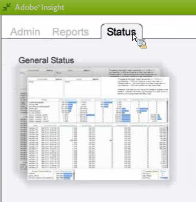

# Data Workbench 프로필 상태 작업 영역{#data-workbench-profile-status-workspace}

{{eol}}

Data Workbench 프로필 상태 프로필은 서버 지표나 내역 데이터가 아닌 프로필을 기반으로 Data Workbench 서버 상태에 대한 현재 정보를 제공합니다.

## Data Workbench 프로필 상태 {#section-65d1fa393cfd450cbacef3cba823fcc1}

이 상태 프로필은 에이전트가 10분마다 폴링되고 보고에는 항상 이 10분 지연을 포함하므로 현재 상태이지만 실제 시간은 아닙니다. 보다 정확하게 말하면 이 프로필에서 생성한 데이터 세트는 에이전트에서 서버에 대한 최신 관찰을 제공하므로 대개 기본 폴링 기간이 10분입니다.

Data Workbench 프로필 상태 프로필에서 사용되는 차원에 대한 추가 참조 정보는 [Insight 프로필 상태 프로필](../../../home/monitoring-installation/monitoring-profiles/monitoring-profile-using.md#concept-d4cd7da41c8a42bab4aea25418264e64).

이 보고서는 구성 요소나 특정 트래픽 변동이 아니라 작업을 모니터링하기 위한 것입니다.

이것은 누가 어떤 모드에 있는지를 우리에게 알려줍니다. 특정 프로필에 대한 빠른 입력 비율이 높은 경우 해당 프로필은 빠른 입력 모드에 있습니다.

정지된 지표가 1이면 서버가 정지됩니다. 값이 0이면 서버가 중지되지 않습니다.

**대량 배치 로드에 대한 로그 읽기**

