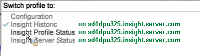

# Data Workbench 서버 모니터링을 위한 작업 영역{#workspaces-for-monitoring-the-data-workbench-server}

{{eol}}

서버 상태 및 성능을 성공적으로 식별하기 위해 표준 Data Workbench 프로필을 사용하여 현재 데이터를 사용하여 설치된 에이전트에서 서버를 모니터링하거나 기록 데이터 세트의 프로필을 사용하여 시간에 따른 성능 변경의 영향을 볼 수 있습니다.

가장 일반적으로 사용되는 Data Workbench 작업 공간은 다음과 같습니다.

* [Insight 기록 작업 공간](../../../home/monitoring-installation/monitoring-profiles/monitoring-historical-using.md#concept-4a4661f3728540e699b92dac80c44015)
* [Insight 프로필 상태 작업 공간](../../../home/monitoring-installation/monitoring-profiles/monitoring-profile-using.md#concept-b4f472ece1094abc9192d89fdce5e104)
* [Insight Server 상태 작업 공간](../../../home/monitoring-installation/monitoring-profiles/monitoring-server-using.md#concept-b4f472ece1094abc9192d89fdce5e104)

프로필을 선택하려면 Data Workbench 클라이언트 인터페이스의 왼쪽 위 모서리에서 드롭다운 메뉴를 엽니다.

